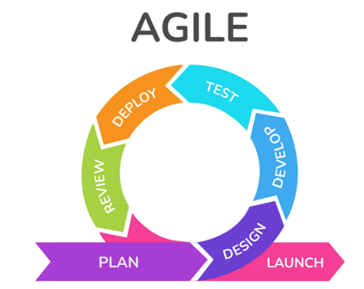

## Agile

Agile refers to a set of values, principles, and practices for software development and project management. It
emphasizes adaptability, collaboration, iterative development, and continuous improvement. The Agile approach aims to
deliver high-quality products efficiently and respond quickly to changing requirements.

#### Agile manifesto

4 values:

- **Individuals and interactions** over processes and tools: Agile prioritizes the importance of effective communication and
collaboration between team members over relying solely on rigid processes or tools.

- **Working software** over comprehensive documentation: Agile emphasizes the delivery of functional software as the primary
measure of progress, rather than extensive documentation that may not reflect the true state of the project.

- **Customer collaboration** over contract negotiation: Agile promotes close collaboration with customers and stakeholders
throughout the development process, valuing their feedback and involvement to ensure the end product meets their needs.

- **Responding to change** over following a plan: Agile recognizes that requirements and circumstances can change over the
course of a project. It emphasizes the ability to adapt and respond to change quickly and effectively.

12 principle :

[READ MORE](https://www.agilealliance.org/agile101/12-principles-behind-the-agile-manifesto/)

