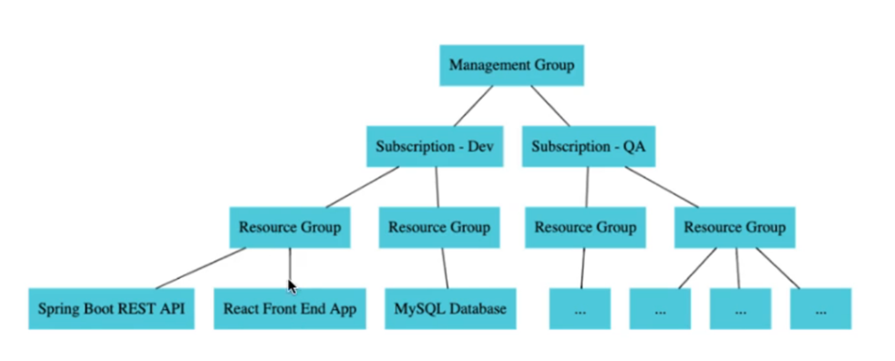
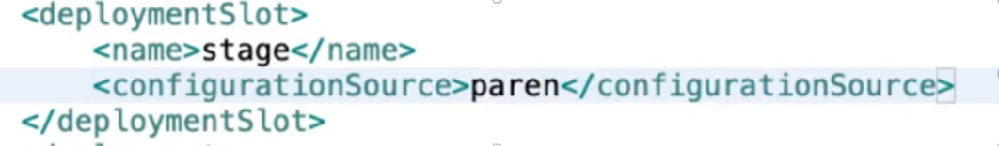

## Azure

#### Basic terminal commands:

- az version
- az login
- az webapp log tail --name **APPNAME** –resource-group **RESOURCE-GROUPNAME**
- mvn clean install (jar vagy war letrehozasa)
- mvn azure-webapp:config (be kell huzni dependencianak a pom.xmlbe az **azure-webapp-maven-plugin** -t)

- az group create --name **GROUPNAME** --location **WESTEUROPE**(vagy ami kell)
- az appservice plan create --name **PLANNAME** --resource-group **GROUPNAME** --sku **TIER**(F1/B1etc.) --is-OS(
  linux/windows)
- az webapp create --resource-group **GROUPNAME** --plan **SERVICEPLAN** --name **VALASZTOTTAPPNAME**
  --multicontainer-config-type compose --multicontainer-config-file docker-compose.yml

### Azure vállalati felepites pelda

De lehet, hogy azonos lifecycle dolgok kerulnek 1 resourcegroup ala(backend mysql)

### Adatbazishoz csatlakozni localhostrol

Azure databasnel engedelyezni kell IP cimet.
Terminal:

- mysqlsh **HOSTNAME** --user **SERVERADMINLOGINNAME**

### Adatbazis(table) letrehozasa AZ CLI-bol

Telepitsunk fel egy extension-t:

- az extension add --name db-up

DB_UP extension setup: (https://github.com/Azure/azure-cli-extensions/blob/main/src/db-up/README.md)

- az mysql -g **MYSQLRESOURCEGROUPNAME** -s HOSTNAME -d **DATABASENAME** -u **USERNAME** -p **PASSWORD**

### Springboot with container

Hasznalhatunk plugint: **dockerfile-maven-plugin** – Ez jar helyet image-t general nekunk.
Az image-t fel tudjuk pusholni dockerhubra.
Hozzunk letre azure resource group-ot azure appservice plant majd magat az app service-t.

### Deploy to staging slot: (blue-green deployment)

Pom.xml-be konfiguralunk egy <deploymentSlot></ deploymentSlot>.
Ezen belul szeretnenk minden minden konfiguraciot athiuzni a prodbol: <configurationSource></configurationSource>-al.

