## Aspect to comparing database management systems

- Storage Architecture
    - Disk vs In-memory
    - Format and Model
- Data Model
    - Relational vs NoSQL
- Data Structure
    - Static vs Dynamic schemas
    - Normalizes vs Denormalized
- Scalability/Cost
- Availability and Resilience
- Level of skills developer required
    - Query language and/or APIs
- Runtime Performance
    - Latency for reads and writes
- Rapid Development
    - Predefined Schema or Schemaless
- Data Integrity
    - ACID vs BASE
- Dataset Size
- Developer community

## SQL

SQL, which stands for Structured Query Language, is a programming language specifically designed for managing and
manipulating relational databases. It is widely used in the field of database management systems (DBMS) and allows users
to define, manipulate, and control data stored in a relational database.

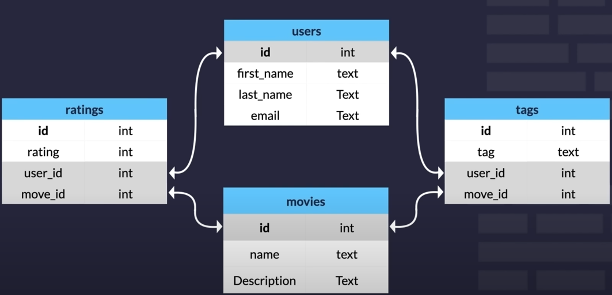

**PROS**:

- Standardized Schema
- Large User community
- Standardizes Query Language
- ACID

**CONS**:

- Difficult clustering / scale
- Data normalization : If we have more table it takes more time to connect and query.
- First schema : We have to plan ahead what data and datatype need.

**Join types**:

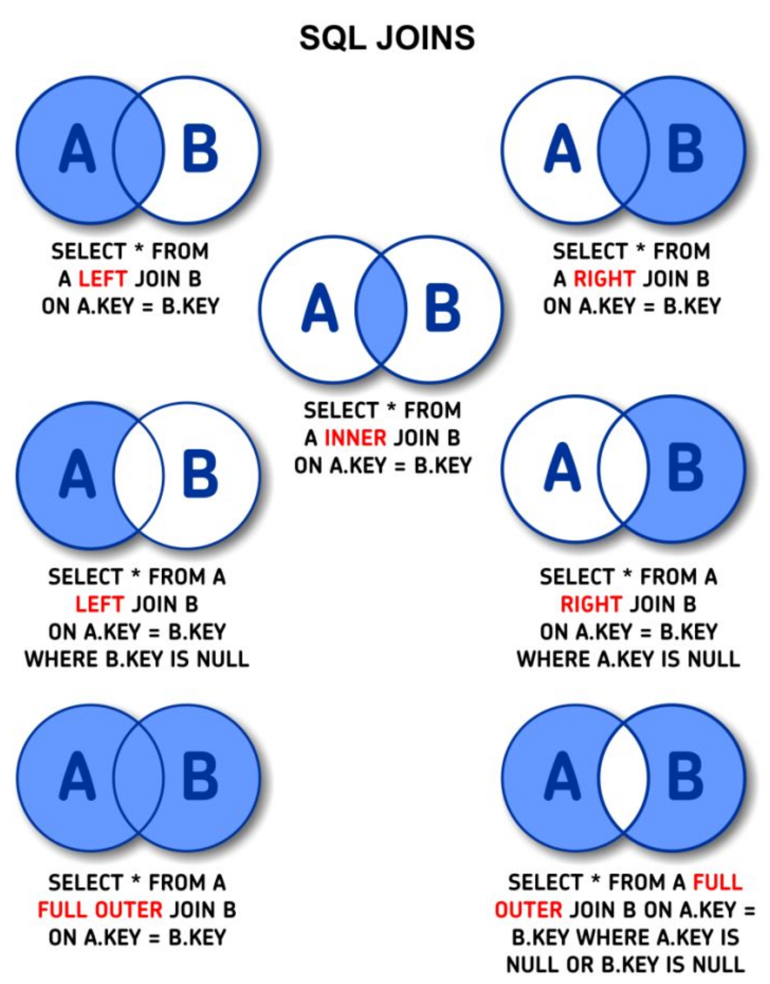

#### Functions

Functions is a stored program that you can pass parameters into to return
a value.

Basic functions:

- count(columName) : count the rows in the given column.

```mysql
SELECT count(firstname)
FROM people;
```

- max(columName)
- min(columName)
- avg(columName)
- sum(columName)
- concat(columName, columName)

```mysql
SELECT concat(first_name, " ", last_name) as full_name
FROM employees;
```

[MySql Functions](https://dev.mysql.com/doc/refman/8.0/en/built-in-function-reference.html)

[Interactive SQL learning page](https://sqlbolt.com/)

## NoSql

- Document based database.
- Developed 2007
- BSON documents : binary representation of Json.
- Flexible
- High scalability (horizontally)
- Cost Effectiveness

PROS:

- Continues availability : data is distributed across multiple service and regions. No single point of failure.
- Query speed
- Agility :
- Cost : easy cheap to scale up

CONS:

- No Standardized query language
- Smaller user community
- Learning curve : No enough to know SQL.
- Data retrieval inconsistency : **NO** ACID compliant.
  It is BASE: Basically Available, Soft state, Eventual consistency

Types:

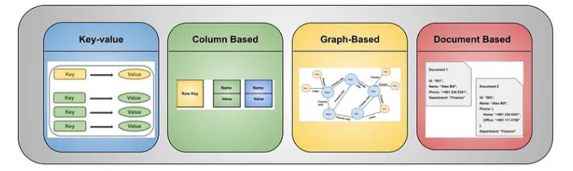

- `Key-value databases` : Most simple NOSQL database type. Most of the time we use for cache.


- `Wide-column database` : optimize for performance

It is between Relation databases and Key-value databases.

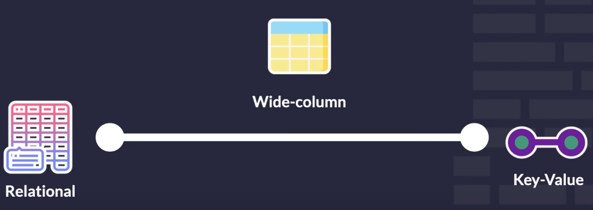

In Apache Cassandra:

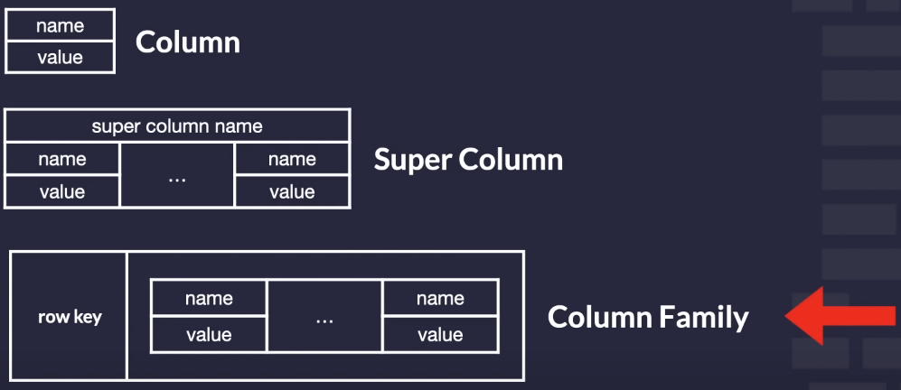

- `Document database` : Group of documents is called a collection. No structure at all.


- `Graph database` : Shows different entities in the database and how they connect in a graphical way.
___

### Normalization vs Denormalization

Normalization - means that data is stored in multiple collections by referencing between them. Data is defined once and
makes it easier to update. When it comes to reading data, the disadvantage of normalization is obvious. If you want to
retrieve data from multiple collections, you need to perform multiple queries. As a result, the reading process is
slower.

Denormalization - Stores a large amount of nested data in a document. This model performs better reads but is slower for
inserts and updates. This method of data storage takes up more memory.

## ACID:

- `Atomicity`: Atomicity guarantees that a transaction is treated as a single, indivisible unit of work. Either all the
  operations within a transaction are successfully completed and permanently saved in the database, or if any part of
  the transaction fails, none of the changes are applied. In other words, it ensures that transactions are
  all-or-nothing operations.


- `Consistency`: Consistency ensures that a transaction brings the database from one consistent state to another. It
  enforces integrity constraints, domain rules, and relationships defined in the database schema. Transactions should
  only be committed if they leave the database in a valid and consistent state. If any transaction violates the
  database's integrity, the changes are rolled back, and the database remains unchanged.


- `Isolation`: Isolation ensures that concurrent transactions do not interfere with each other. Each transaction operates
  in isolation from other transactions, as if it were executed sequentially. This prevents issues such as dirty reads,
  non-repeatable reads, and phantom reads. Isolation levels, such as Read Uncommitted, Read Committed, Repeatable Read,
  and Serializable, define the degree of isolation provided by a database system.


- `Durability`: Durability guarantees that once a transaction is committed, its changes are permanently saved in the
  database, even in the event of system failures, crashes, or power outages. The changes are stored in non-volatile
  storage, such as hard disks or solid-state drives (SSDs), to ensure their persistence. This property ensures that the
  data remains intact and recoverable, maintaining the reliability of the database.

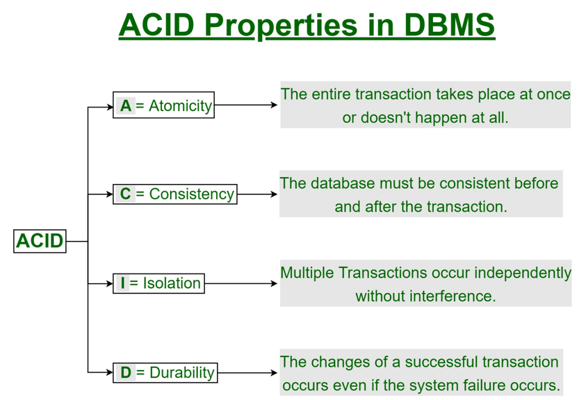

## CAP theorem

- Consistency : All nodes in a distributed system see the same data at the same time.
- Availability : The system should always respond to client requests, even in the presence of failures.
- Partition Tolerance : The system's ability to continue operating even if there are network failures or partitions
  between nodes.

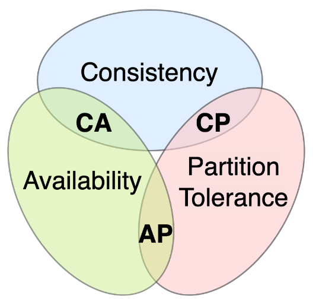

The CAP theorem states that in the presence of a network partition, a distributed system can only achieve two out of the
three properties:

- CA

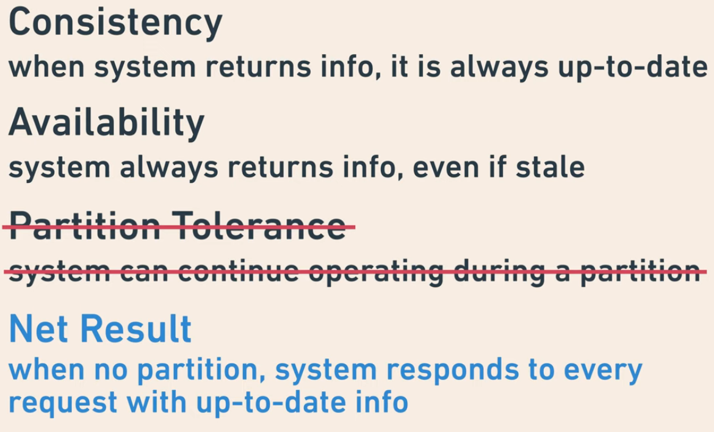

- CP

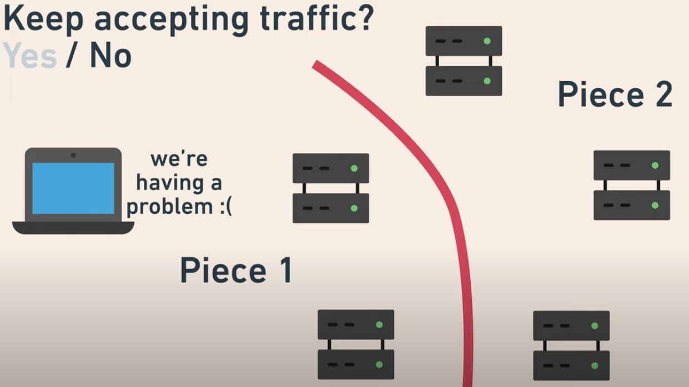

- AP

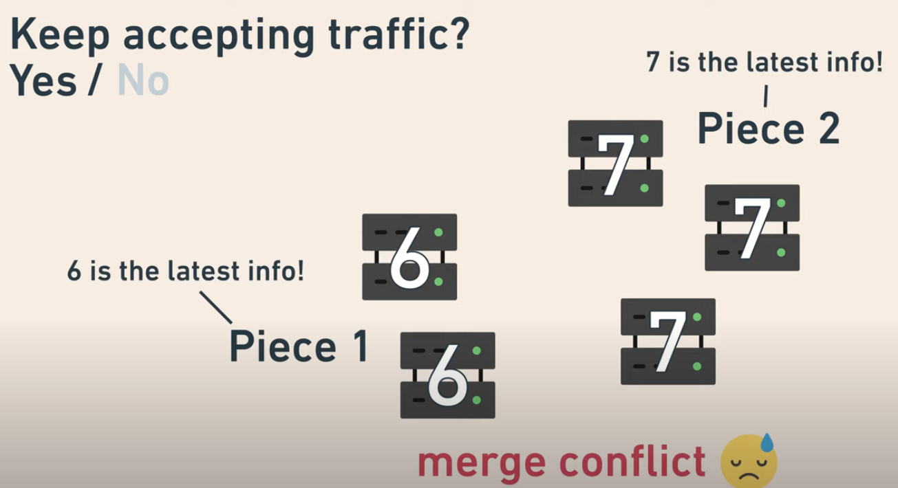

### Database basic security

- `Physical access ` : If a data center is not physically protected, all other data security measures become
  significantly less valuable. Locks on doors, cameras, etc.


- `Encryption`: Encryption is used to protect data both at rest and in transit. Data at rest refers to data stored in
  the
  database files, while data in transit refers to data being transmitted between the database server and client
  applications. Encryption algorithms are employed to convert sensitive information into unreadable ciphertext, which
  can only be deciphered with the appropriate encryption keys.


- `SQL injection attack prevention` : parameterized queries or prepared statements should be used. This technique
  separates SQL code from user-supplied input, reducing the possibility of malicious SQL commands being injected into
  queries.


- `Database authorization and access control` : Users must be granted permissions to view and work with data in the
  database. Privileges should only be granted in order for a user to perform a job. Shared or group login credentials
  should be avoided. A principle of least privilege should be applied.


- `Regular Patching and Updates` : It is crucial to keep the database software up to date with the latest security
  patches
  and updates. This helps protect against known vulnerabilities and exploits.


- `Backup and Recovery` : Regularly backing up the database and storing backups in secure locations ensures that data
  can
  be restored in case of a security incident, data corruption, or system failure.

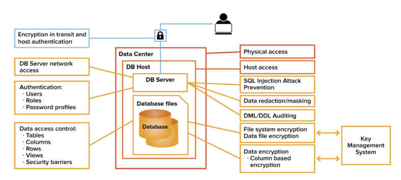


### Clustering and replication

##### <u>Clustering</u>

Database clustering is a technique of combining multiple database servers or nodes into a unified cluster to
provide high availability, fault tolerance, and scalability for database systems (communication usually through a
loadbalancer).

Multiple database nodes work together as a single logical unite.

- **Availability** : Replicating data across multiple nodes in the cluster. If one node fails, another node takes
  over the processing responsibilities, ensuring that the database remains accessible and operational.


- **Scalability** : Clustering enables horizontal scalability, allowing the addition of more nodes to the cluster to
  handle increased data volume or user load (loadbalancer).


- **Data synchronization**: In a clustered database, data synchronization mechanisms ensure that data changes made on
  one node are propagated to the other nodes in the cluster. This ensures data consistency across the entire cluster and
  enables seamless failover and load balancing.
  Master(read and write all data) - slave node (read data)

<u>Replication</u>

Replication is nothing else but creating copies of your data and distributing those copies over multiple physical
server.

**Questions**:z

- How to synchronize data copies?
- Which copy to use?
- Where to read and write?
- Is this copy up-to-date?

**Patterns:**

- Master(read and write all data) - slave node (read data)

### Partitioning and Sharding

Sharding and partitioning are both about breaking up a large data set into smaller subsets.

The difference is that sharding implies the data is spread across multiple computers while partitioning does not.
Partitioning is about grouping subsets of data within a single database instance.

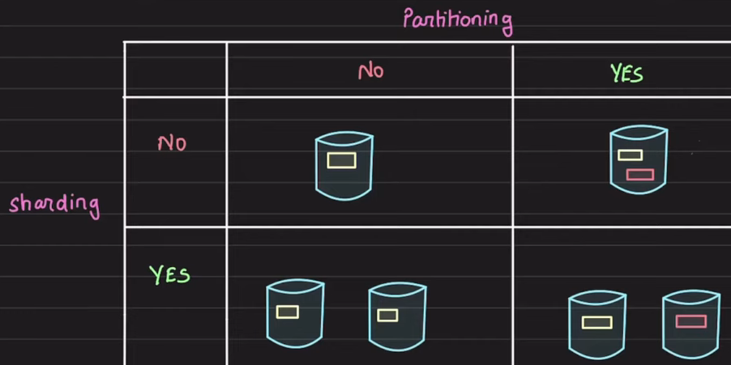

In many cases, the terms sharding and
partitioning are even used synonymously, especially when preceded by the terms “horizontal” and “vertical.” Thus,
“horizontal sharding” and “horizontal partitioning” can mean the same thing.

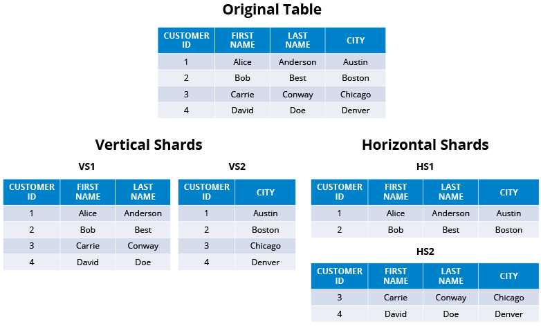

("Database server is `sharded` and data is `partitioned`")

**Advantage** of sharding:

- Handle large Reads and Writes
- Increase overall storage capacity
- higher availability

**Disadvantage** of sharding:

- operationally complex
- cross-shared quires expensive


