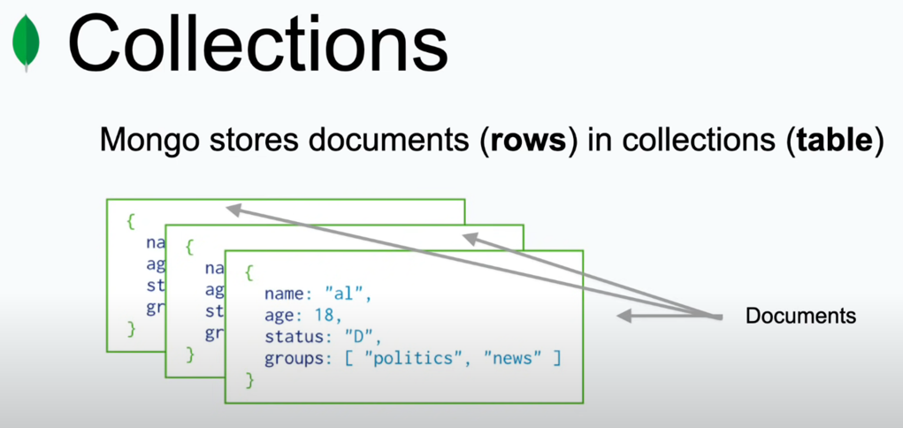

## SQL

SQL, which stands for Structured Query Language, is a programming language specifically designed for managing and
manipulating relational databases. It is widely used in the field of database management systems (DBMS) and allows users
to define, manipulate, and control data stored in a relational database.

PROS:

- Standardized Schema
- Large User community
- Standardizes Query Language
- ACID

CONS:

- Difficult clustering / scale
- Data normalization : If we have more table it takes more time to connect and query.
- First schema : We have to plan ahead what data and datatype need.

## NoSql

- Document based database.
- Developed 2007
- BSON documents : binary representation of Json.
- Flexible
- High scalability (horizontally)
- Cost Effectiveness

PROS:

- Continues availability : data is distributed across multiple service and regions. No single point of failure.
- Query speed
- Agility : 

CONS:

Types:

- Key-value databases
- column store : optimize for performance
- Graph database : Shows different entities in the database and how they connect in a graphical way.
- Document store database: Group of documents is called a collection.

#### ACID:

- Atomicity: Atomicity guarantees that a transaction is treated as a single, indivisible unit of work. Either all the
  operations within a transaction are successfully completed and permanently saved in the database, or if any part of
  the transaction fails, none of the changes are applied. In other words, it ensures that transactions are
  all-or-nothing operations.

- Consistency: Consistency ensures that a transaction brings the database from one consistent state to another. It
  enforces integrity constraints, domain rules, and relationships defined in the database schema. Transactions should
  only be committed if they leave the database in a valid and consistent state. If any transaction violates the
  database's integrity, the changes are rolled back, and the database remains unchanged.

- Isolation: Isolation ensures that concurrent transactions do not interfere with each other. Each transaction operates
  in isolation from other transactions, as if it were executed sequentially. This prevents issues such as dirty reads,
  non-repeatable reads, and phantom reads. Isolation levels, such as Read Uncommitted, Read Committed, Repeatable Read,
  and Serializable, define the degree of isolation provided by a database system.

- Durability: Durability guarantees that once a transaction is committed, its changes are permanently saved in the
  database, even in the event of system failures, crashes, or power outages. The changes are stored in non-volatile
  storage, such as hard disks or solid-state drives (SSDs), to ensure their persistence. This property ensures that the
  data remains intact and recoverable, maintaining the reliability of the database.

