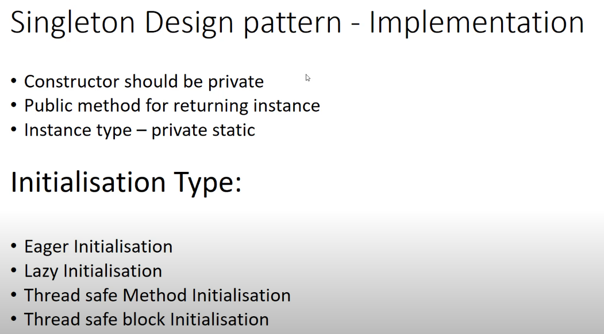

## Design Patterns

<u>Design Principles</u>:
- high-level guidelines
- pure abstractions - without implementation
- any programming language
- platform independent

<u>Design Patterns</u>:
- Low-level solutions OOP related problems
- concrete implementation
- Several design principle can be **implemented by design patterns**

### Creational patterns:

**Singleton**:

When to use it? 

We have to control access to a shared resource(files, databases, thread pools, logging)

Not threadsafe but we can use synchronized keyword (slow solution) or use ENUM which compile time constants.

**Factory**

