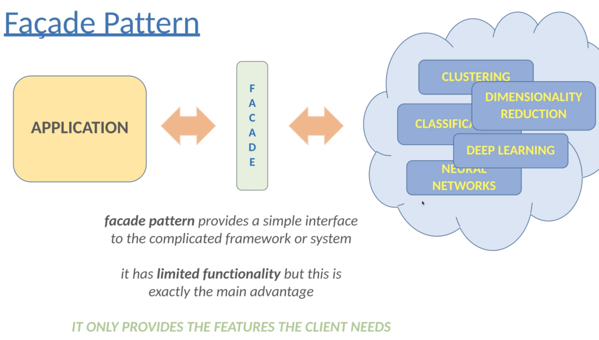
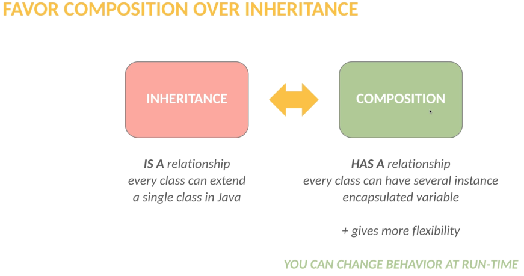
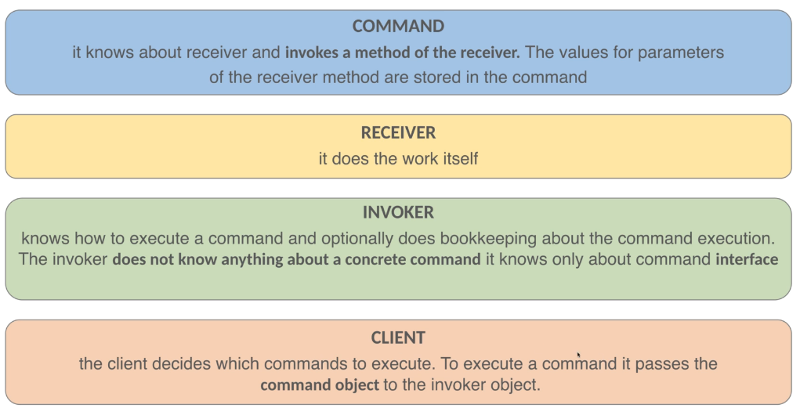

## Design Patterns

<u>Design Principles</u>:

- high-level guidelines
- pure abstractions - without implementation
- any programming language
- platform independent

<u>Design Patterns</u>:

- Low-level solutions OOP related problems
- concrete implementation
- Several design principle can be **implemented by design patterns**

### **Creational patterns:**

#### Singleton: [Example](creational_design_patterns/d01singleton/SingletonExample.java)

When to use it?

We have to control access to a shared resource(files, databases, thread pools, logging)

Not threadsafe but we can use synchronized keyword (slow solution) or use ENUM which compile time constants.

#### Factory: [Example](creational_design_patterns/d02factory/FactoryPatternExample.java)

- Help to create loosely coupled OOP design
- Fundamental prblem with the **new** keyword
    - "We should favor abstraction(supertypes) instead of concrete implementation"
- if we use **new** keyword - we violate this principle

#### Builder: [Example](creational_design_patterns/d03builder/BuilderPatternExample.java)

- We can use it when we have large number of variables for an entity.
- If we do not use it, maybe we have 3-4 constructor with different parameters.
- Last step is build(), after that object is immutable and it is thread safe.

#### Prototype: [Example](creational_design_patterns/d04prototype/PrototypePatternExample.java)

- Aim is to be able to copy existing object without depending on these given classes.

### **Structural patterns:**

#### Decorator: [Example](structural_design_patterns/d08decorator)

We would like to add one or more behaviors dynamically.

Problems:

- We can use inheritance to **change the behavior** of a given component.
  Problem is that inheritance is **static.**
- We can not change behaviors at **run-time.**

Solution with decorator:

- We can attach additional responsibilities to an object dynamically.
- **Flexible alternative** to subclassing and for extending functionality.
    - example: newLineNumberInputStream(new BufferedInputStream(new FileInputStream()))

#### Facade: [Example](structural_design_patterns/d06facade)

Problems:

- When we would like to deal with complicated library/framework
- Classes may become tightly coupled to the implementation of the framework or library.

Solution:

- Facade pattern can provide a relatively easy to understand interface to a rather complex system.

#### Flyweight: [Example](structural_design_patterns/d9flyweight)

We want to minimize memory usage -> sharing data with similar objects.

<u>Example:</u> in a **document** every character share the same : font, metrics etc.
We create a flyweight object and every single character refers to it.

### **Behavioral patterns**:

#### Strategy: [Example](behavioral_design_patterns/d10strategy)

- Enable selecting an algorithm at run-time.
- Define a family of algorithms, put them into a separate class, and make their objects **interchangeable**.
- We can achieve **open/close** and **dependency inversion** principles.

#### Observer: [Example](behavioral_design_patterns/d11observer)

We can achieve **loosely coupled** system. Objects can interact, but they have **little knowledge** of each other.

- Defines **one-to-many** dependency between given objects or entities.
- When object changes state all of its dependents are notified and updated automatically
- the **subject** is the object that is being monitored
- **observers**(listeners) are depending on the **subject**.

Benefits:

- We don't have to modify the subject to add new type of observers.
- We can **reuse** subjects and observers
- We can **change** the subject or observer independently.

#### Command: [Example](behavioral_design_patterns/d12command)

Interface component knows nothing about underlying **business logic** or model.
We are able to change the **sender's behavior** at run-time.

4 components of command pattern:

1. Command
2. Receiver
3. Invoker
4. Client

Advantages:

- Decouple classes that invoke the operations and the classes that will execute these operation.
  -> _Loosely coupled design + single responsibility._
- We can add further commands **without modifying** existing code -> _open/close principle_
- We do not have to **execute the commands immediately**. We can store these command
  in a data structure. -> _We can implement undo/redo operation_.(example: photoshop, intellij etc...)

