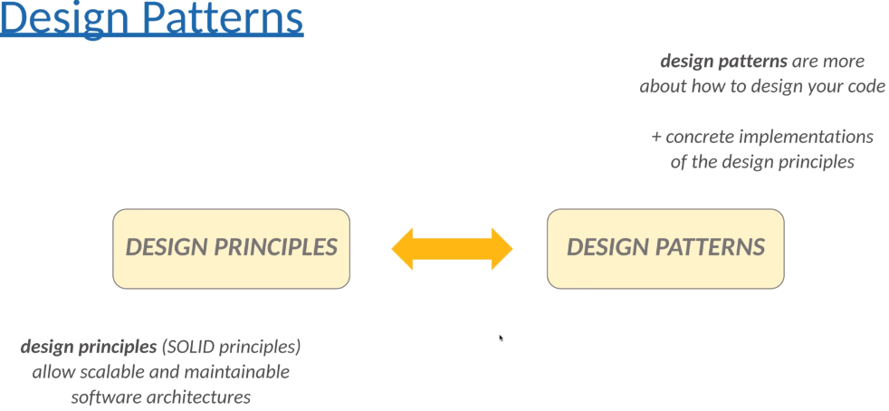
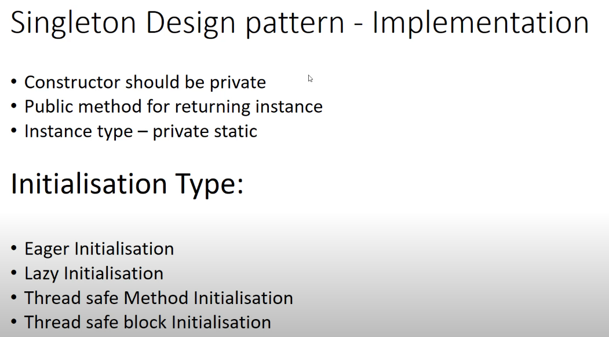
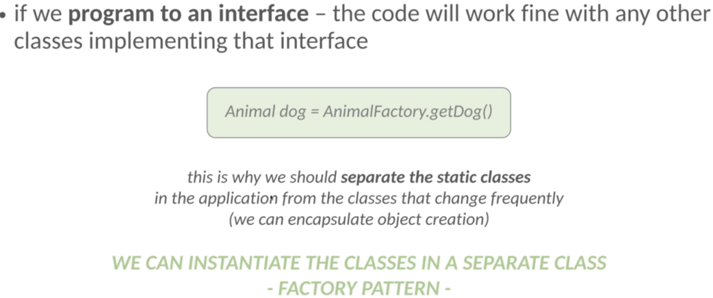
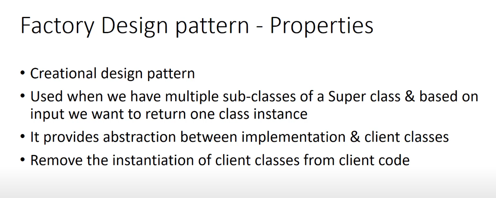
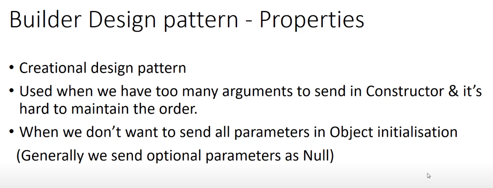
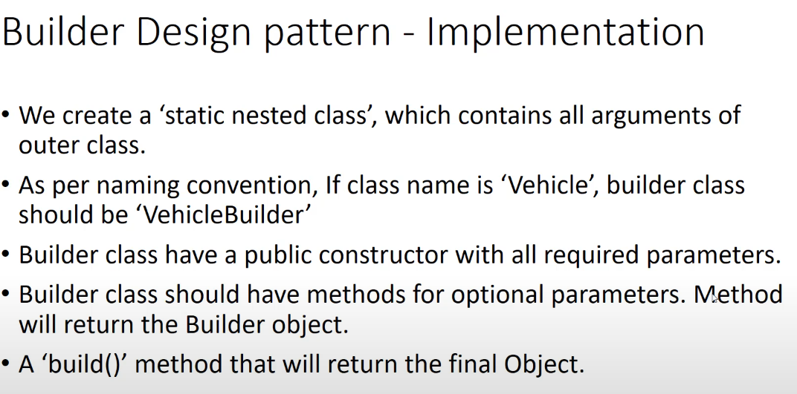
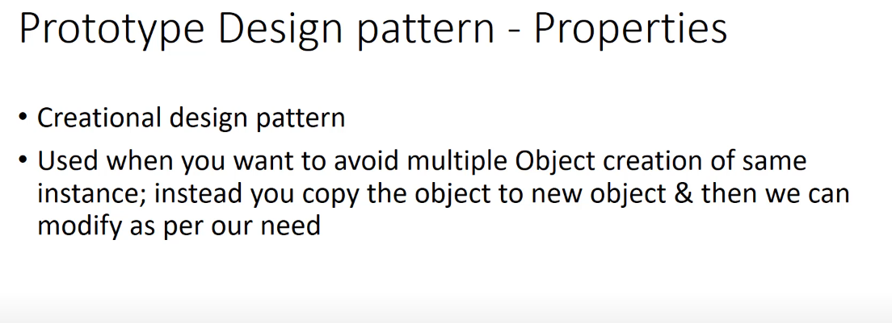

## Design Patterns

<u>Design Principles</u>:
- high-level guidelines
- pure abstractions - without implementation
- any programming language
- platform independent

<u>Design Patterns</u>:
- Low-level solutions OOP related problems
- concrete implementation
- Several design principle can be **implemented by design patterns**

### Creational patterns:

**Singleton**: [Example](creational_design_patterns/d01singleton/SingletonExample.java)

When to use it? 

We have to control access to a shared resource(files, databases, thread pools, logging)

Not threadsafe but we can use synchronized keyword (slow solution) or use ENUM which compile time constants.

**Factory**: [Example](creational_design_patterns/d02factory/FactoryPatternExample.java)

- Help to create loosely coupled OOP design
- Fundamental prblem with the **new** keyword
  - "We should favor abstraction(supertypes) instead of concrete implementation"
- if we use **new** keyword - we violate this principle

**Builder**: [Example](creational_design_patterns/d03builder/BuilderPatternExample.java)

- We can use it when we have large number of variables for an entity.
- If we do not use it, maybe we have 3-4 constructor with different parameters.
- Last step is build(), after that object is immutable and it is thread safe.

**Prototype**: [Example](creational_design_patterns/d04prototype/PrototypePatternExample.java)

- Aim is to be able to copy existing object without depending on these given classes.

