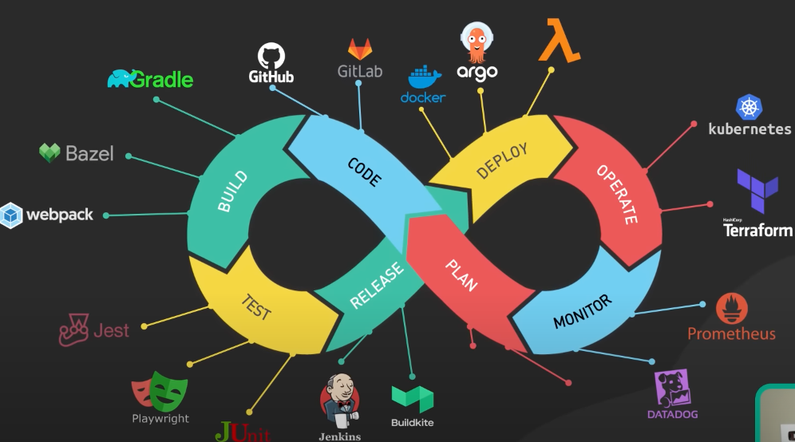
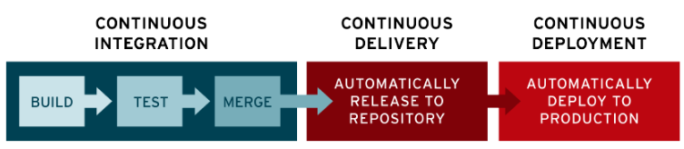
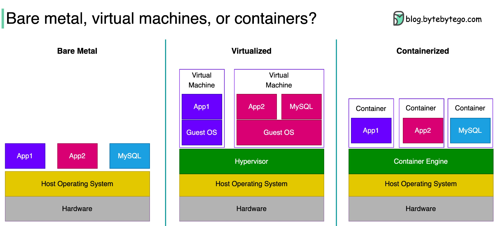
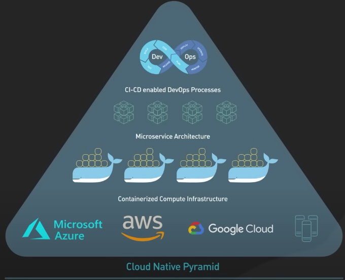
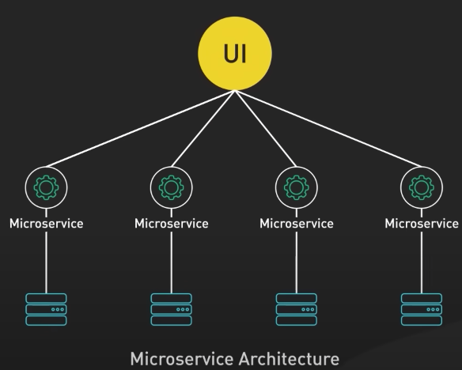
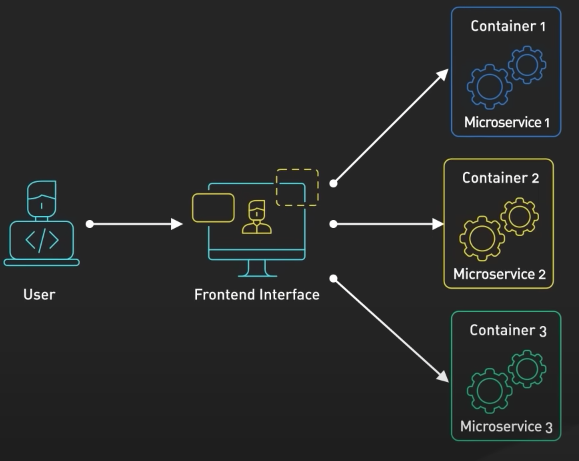

# Devops

<!-- TOC -->
* [Devops](#devops)
    * [<u>Culture</u>](#ucultureu)
    * [<u>Environment and containers</u>](#uenvironment-and-containersu)
    * [<u>Continuous Integration and Continuous Delivery/Deployment</u>](#ucontinuous-integration-and-continuous-deliverydeploymentu)
    * [<u>Bare-metal vs virtualization vs containerisation</u>](#ubare-metal-vs-virtualization-vs-containerisationu)
        * [Bare-Metal](#bare-metal)
        * [Virtual Machine](#virtual-machine)
        * [Containers](#containers)
    * [<u> Cloud computing </u>](#u-cloud-computing-u)
    * [<u>What is Cloud Native development?</u>](#uwhat-is-cloud-native-developmentu)
<!-- TOC -->

### <u>Culture</u>

DevOps culture is a set of values, principles, and practices that promote collaboration, communication, and continuous
improvement across the entire software development lifecycle. DevOps culture emphasizes breaking down the traditional
silos between development, operations, and other teams involved in the software development process and fostering a
shared sense of ownership and responsibility for the end-to-end delivery of software.

Some key aspects of DevOps culture include:

- Collaboration and communication: DevOps culture promotes cross-functional collaboration and communication between
  development, operations, and other teams involved in the software development process. This helps ensure that everyone
  is aligned on the goals and objectives of the project and can work together to overcome any obstacles or challenges.

- Automation and continuous delivery: DevOps culture emphasizes the use of automation and continuous delivery practices
  to streamline the software development process and enable faster, more frequent, and more reliable releases of
  software.

- Monitoring and feedback: DevOps culture emphasizes the importance of monitoring and feedback to enable continuous
  improvement and learning. This includes monitoring the performance and availability of software applications in
  production and collecting feedback from users and stakeholders to identify areas for improvement.

- Experimentation and risk-taking: DevOps culture encourages experimentation and risk-taking to drive innovation and
  accelerate learning. This includes testing new ideas and technologies and embracing failure as an opportunity to learn
  and improve.

- Continuous learning and improvement: DevOps culture emphasizes the importance of continuous learning and improvement
  to keep up with the rapidly changing technology landscape. This includes investing in training and development for
  team members and continually seeking out new tools and best practices to improve the software development process.

- Overall, DevOps culture is focused on creating a collaborative, agile, and customer-centric approach to software
  development that enables teams to deliver high-quality software faster and more reliably.

### <u>Environment and containers</u>

Environment and containers refer to the infrastructure and technology used to manage and
deploy software applications.

Environment in DevOps generally refers to the hardware, software, and configuration settings that define the context in
which an application runs. This includes things like operating system, application server, database, network settings,
and other system components. Creating and managing environments for software applications is a critical aspect of
DevOps, as it ensures that the application can run consistently and reliably in different contexts, such as development,
testing, and production.

Containers are a technology used in DevOps to package and deploy applications and their dependencies in a lightweight
and portable manner. Containers are self-contained and isolated environments that include everything needed to run an
application, such as code, libraries, and runtime. By using containers, DevOps teams can create a consistent and
reproducible environment for running applications, which can be easily moved between different environments, such as
development, testing, and production.

Containerization provides several benefits in DevOps, such as:

* Consistency: Containers provide a standardized environment that is consistent across different systems and
  environments, which helps ensure that the application runs reliably in any context.
* Portability: Containers can be easily moved between different systems and environments, which enables faster and more
  efficient deployment of applications.
* Isolation: Containers provide a secure and isolated environment for running applications, which helps prevent
  conflicts and errors caused by dependencies or configuration issues.
* Scalability: Containers can be easily replicated and scaled horizontally to handle increased traffic or demand, which
  helps ensure that the application can handle peak loads without downtime or performance issues.

Overall, environment and containers are important concepts in DevOps, as they enable teams to create consistent,
scalable, and reliable infrastructure for deploying and managing software applications.

### <u>Continuous Integration and Continuous Delivery/Deployment</u>

CI/CD is a software development methodology that emphasizes
automating the software delivery pipeline and streamlining the release process.

Continuous Integration (CI) is the practice of regularly integrating code changes into a shared repository and running
automated tests to ensure that the changes are working as intended and don't break existing functionality. This helps
detect and fix issues early in the development cycle and ensures that the software is always in a releasable state.

Continuous Delivery (CD) is the practice of automating the entire software delivery process, from code changes to
deployment to production. This involves creating a fully automated pipeline that can build, test, and deploy the
software application to any environment, such as development, testing, or production.

Continuous Deployment (also known as Continuous Deployment) takes Continuous Delivery one step further by automatically
deploying the application to production as soon as changes pass all automated tests and quality checks. This ensures
that new features and improvements are delivered to users quickly and efficiently.

<u>Some key benefits of CI/CD include:</u>

* Faster and more frequent releases: CI/CD enables faster and more frequent releases of software, which helps teams
  deliver new features and improvements to users more quickly and efficiently.

* Improved quality: CI/CD helps improve the quality of software by detecting and fixing issues early in the development
  cycle and ensuring that the software is always in a releasable state.

* Increased efficiency: CI/CD automates many of the manual processes involved in software delivery, which helps teams
  work more efficiently and reduce errors and delays.

* Greater agility: CI/CD enables teams to respond more quickly to changes in the market or customer needs by delivering
  new features and improvements faster.

Overall, CI/CD is a powerful software development methodology that enables teams to deliver high-quality software faster
and more reliably, while also increasing efficiency and agility.

### <u>Bare-metal vs virtualization vs containerisation</u>

##### Bare-Metal

The granddaddy of these is bare metal. A bare metal server is a physical computer
that is a single tenant only.

Bare metal gives us complete control over the hardware resources and the software stack to run.
For software applications that require the absolute highest performance from the hardware, bare metal could be a good
way to go.

Bare metal servers are physically isolated.

𝐁𝐞𝐧𝐞𝐟𝐢𝐭𝐬:

✅ First, it is not affected by the noisy neighbor problem.

✅ Second, the isolation provides the highest level of security.

𝐃𝐨𝐰𝐧𝐬𝐢𝐝𝐞:

🚫 Bare metal is expensive, hard to manage, and hard to scale.

##### Virtual Machine

A virtual machine is the emulation of a physical computer. This is called virtualization.

Running on top of the host operating system is a special piece of software called a hypervisor.
This is also known as a virtual machine monitor.

The hypervisor manages virtual machines. It creates an abstraction layer over the hardware,
so that multiple operating systems can run alongside each other.

Each virtual machine has its own guest operating system.
On top of each guest operating system runs the applications for a tenant.

𝐁𝐞𝐧𝐞𝐟𝐢𝐭𝐬:

✅ Virtual machines are cheaper to run.

✅ They are easier to scale.

🚫 Virtual machines could be vulnerable to the noisy neighbor problem.

##### Containers

A container is a lightweight and standalone package of an application with all
its dependencies like libraries, frameworks, and runtime.
Containerization is considered to be a lightweight version of virtualization.

𝐁𝐞𝐧𝐞𝐟𝐢𝐭𝐬:
✅ The container engine provides even faster resource provisioning.

✅ Containers are scalable and portable.

✅ Since each container runs as a native process of the host operating system, they are much faster to start.

✅ All these make containers even easier to deploy and maintain at scale.

𝐃𝐨𝐰𝐧𝐬𝐢𝐝𝐞:

🚫Potentially less secure

In conclusion, system design is about tradeoffs. It is no different when it comes to bare metal,
virtual machines and containers. There is no single right answer.

### <u> Cloud computing </u>

Cloud computing is the delivery of on-demand computing resources over the internet, including computing power, storage,
and applications. These resources can be accessed by users on a pay-per-use basis or through subscription models.

<u>Cloud computing has three main service models</u>:

- Infrastructure as a Service (IaaS): This model provides users with access to computing resources such as virtual
  machines, storage, and networking.

- Platform as a Service (PaaS): This model provides users with a platform to develop, run, and manage applications
  without worrying about the underlying infrastructure.

- Software as a Service (SaaS): This model provides users with access to software applications that are hosted and
  managed by the provider, with the users accessing the applications through a web browser or application programming
  interface (API).

<u>Cloud computing has several advantages, including:</u>

1. Scalability: Cloud resources can be scaled up or down quickly and easily to match changing demands, allowing
   businesses
   to avoid over-provisioning or under-provisioning.

2. Cost savings: Cloud computing eliminates the need for expensive hardware and infrastructure, reducing capital
   expenses
   and shifting costs to operational expenses.

3. Accessibility: Cloud resources can be accessed from anywhere with an internet connection, enabling remote work and
   collaboration.

4. Flexibility: Cloud computing provides a range of services, including Infrastructure as a Service (IaaS), Platform as
   a
   Service (PaaS), and Software as a Service (SaaS), giving businesses the flexibility to choose the level of control
   and
   customization they need.

5. Reliability: Cloud providers typically offer high availability and disaster recovery solutions, reducing the risk of
   downtime and data loss.

<u>There are also some potential challenges associated with cloud computing, including:</u>

1. Security: Cloud computing requires users to trust their data to third-party providers, increasing the risk of data
   breaches and cyber attacks.

2. Vendor lock-in: Moving data and applications between cloud providers can be challenging and expensive, leading to
   vendor
   lock-in.

3. Performance: Cloud computing relies on internet connectivity, which can affect application performance and user
   experience.

Cloud computing has become an essential part of modern technology, enabling businesses of all sizes to access
powerful computing resources on demand and at an affordable cost.

### <u>What is Cloud Native development?</u>

Cloud Native development is a software development approach that aims to build and run scalable applications in modern,
dynamic, and distributed environments such as public and private clouds, containers, and microservices.

It involves designing and deploying applications that are optimized for the cloud infrastructure, utilizing cloud-native
technologies and architectures, and leveraging cloud-specific features like auto-scaling and elastic load balancing.

Cloud Native development is often associated with the following principles and practices:

- Microservices: breaking down large applications into small, independent services that can be developed, deployed, and
  scaled independently.

- Containers: packaging each microservice into a lightweight, portable container that can run anywhere, ensuring
  consistency between development, testing, and production environments.

- CI/CD

- Orchestration: automating : example: kubernetes.

