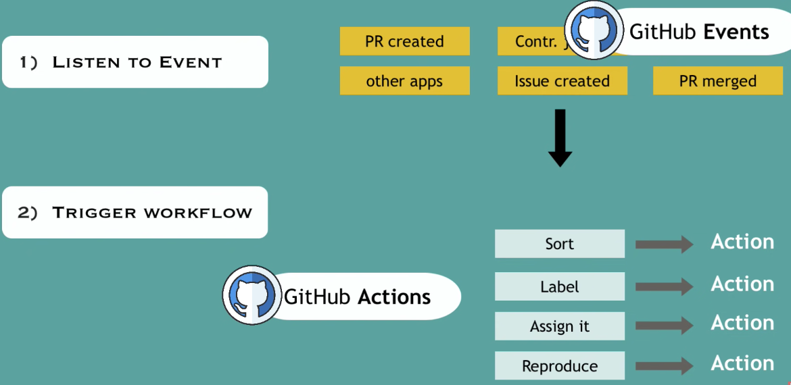

## GitHub actions

##### How GitHub Actions automate workflows?

When something happens **IN** or **TO** (GitHub events: pr, issue created etc...) your repository
**automatic actions** are executed in response.



##### Why is set up easier?

Integration with other technologies is important and automatic.

- We don't have to install java, maven,docker for example. Actions will do that instead of us.
- We just tell that we need an environment with java. specific version etc. 


Example basic actions:

```yaml

# Name of the workflow. Describe what it is doing. 
Name: Java CI with Gradle

# Events which triggers the workflow.
on:
  push:
    branches: [ "master" ]
  pull_request:
    branches: [ "master" ]

permissions:
  contents: read

jobs: # group a set up actions which will be executed.
  build:

    runs-on: ubuntu-latest

    steps:
      - uses: actions/checkout@v3 # checkout code (predefined action)

      - name: Set up JDK 11
        uses: actions/setup-java@v3 # prepare the environment with java
        with:
          java-version: '11'
          distribution: 'temurin'

      - name: Build with Gradle
        uses: gradle/gradle-build-action@67421db6bd0bf253fb4bd25b31ebb98943c375e1
        with:
          arguments: build

```