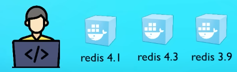
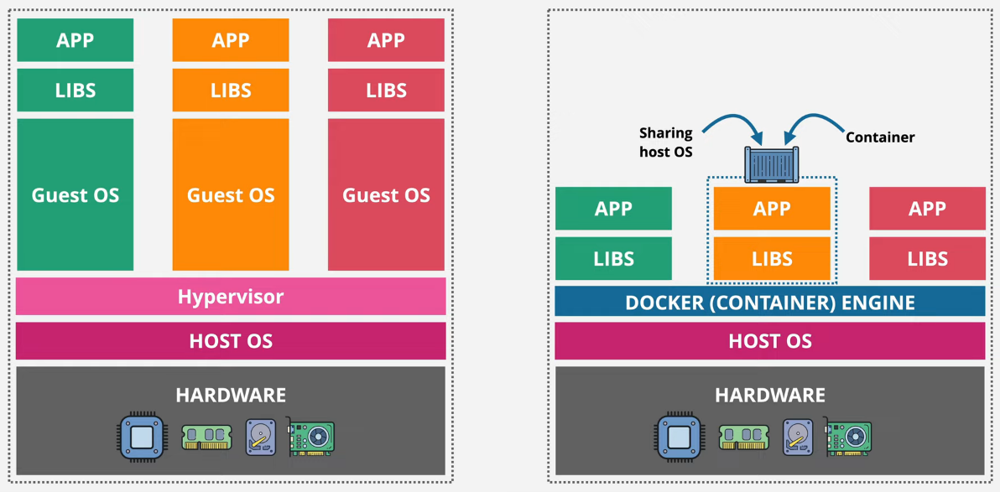
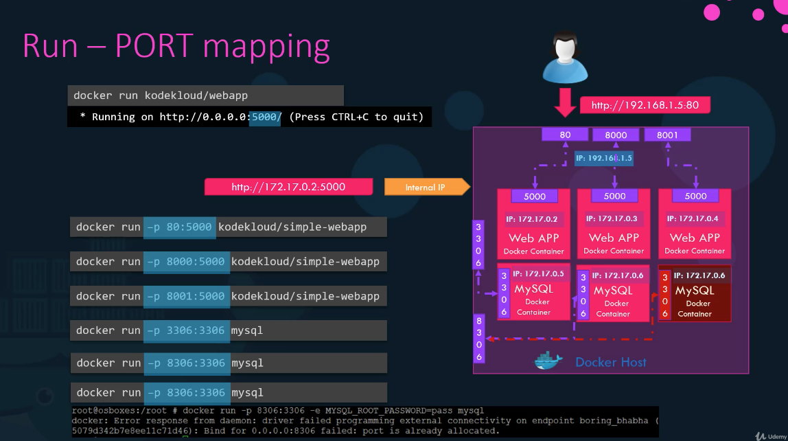
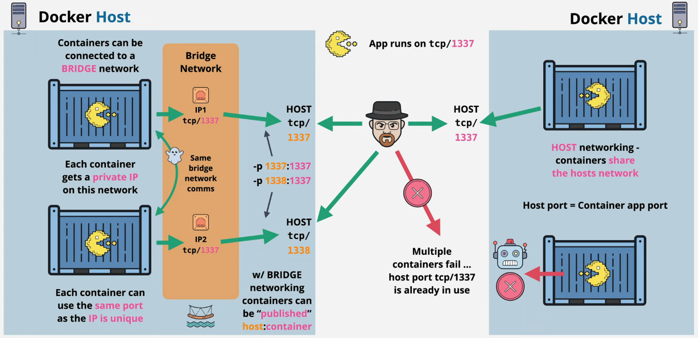
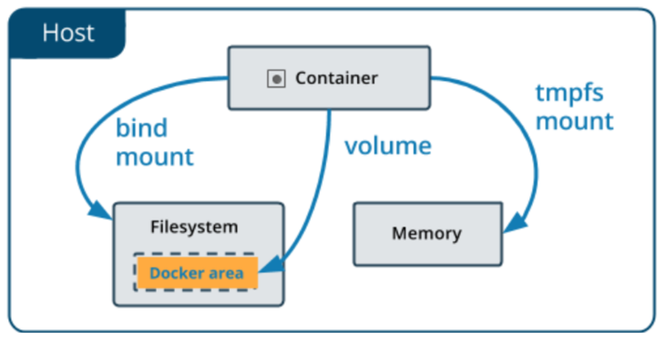
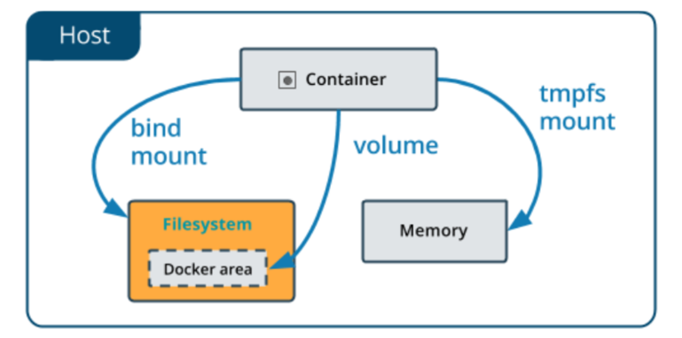
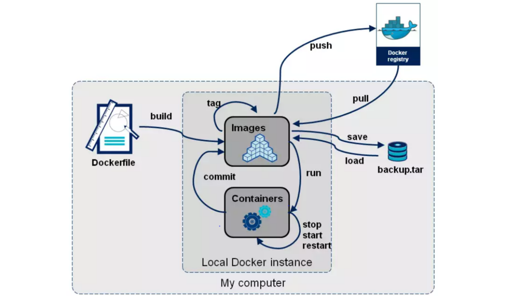

### Docker

#### What is Docker?

- A virtualization software which makes developing and deploying much easier.
- Packages application with all the necessary dependencies, configuration, system tools.
- Portable artifact, easily shared and distributed.

Docker **standardized process** of running any service on **any** local dev environment.

It is easy to run different version of the same app without any conflict.



#### Docker vs Virtualization

Operating system has 2 main layer: Kernel and Application layer.
Kernel "talks" with hardware and software components.

**Docker** will virtualize the Application layer , **Virtualization** will the Kernel and the OS as well.



Docker images smaller, faster to start. Linux based Docker image is not compatible with Windows OS, but
Virtualization is.

**Solution**: Docker Desktop uses a Hypervisor layer with lightweight Linux distro.

#### Install Docker

Follow the steps:

- https://www.docker.com/get-started/
- https://docs.docker.com/desktop/

#### Docker ignore

```dockerignore

.gradle/        # Hidden directory(because of . ) , exclude that and the sub directory
build/          # Not hidden directory, exclude that and the sub directory
*.jar           # All file which has .jar extension.
**/folder-name  # In any folder which has the given folder name.

```

What should we ignore?
- .git directory
- build logs
- temporary files
- cache files
- password, secret data
- node_modules, .idea, build, target... directories

#### Docker Image

- Easily shareable and movable
- Like zip, jar, war file but contains not just the codes, but **complete environment configuration**.
- Add environment variables, create directories, files etc..
- Image versioning called: **tags**

Many Docker images follow semantic versioning conventions, where tags represent major, minor, and patch versions.

For example:

nginx:1.19.6 represents major version 1, minor version 19, and patch version 6.

Semantic versioning helps to convey the compatibility and significance of different image versions.

Tag types:

- `latest` : It is often used to represent the most recent version or build of an image. It is commonly assigned to the
  latest stable release or build.

- `slim` : reduced image size, only essential components and dependencies, making them lighter and more suitable for
  environments with limited resources.


- `alpine` : mages based on the Alpine Linux distribution. Alpine images are known for their small size and minimalistic
  nature. They are commonly used for lightweight and resource-efficient deployments.


- `bullseye`: mages based on the Debian GNU/Linux distribution with the code name "Bullseye".


- `windowsservercore` : Windows-based Docker images. These images are used for running Windows-based applications in
  containers.

#### Docker Container

- Actually starts the application
- A running instance of an image
- We can start multiply containers from 1 image.
- "immutable infrastructure" : only-redeploy containers, never change

#### Docker CLI commands:

      - docker images : It shows all images on the computer
      - docker pull **imageName** : Pulls down the given image from dockerhub
      - docker run **{name}:{tag}** : Creates container from the given image:tag. (If the image not available in locally it
        will pull from DockerHub)
      - docker build : Build image fom specific Dockerfile
      - docker ps / docker container ls : Shows running containers
      - docker ps -a / docker container ls -a : Shows all container
      - docker image ls :  Images that are currently available on your system and a container created from it.
      - docker image ls -a: Shows all image
      - docker stop **{containerId}** : Stops given container
      - docker log **{containerId}** : Shows logs for the given container.
      - docker container inspect mysql : Shows all information about the container
      - docker container stats : streaming live performance for all container
      - docker container port **{containerName}** : Shows publishing ports HOST:CONTAINER
      - docker commit {runningContainerId/name} {new Image name} : We can create new image from modified container.  

**Flags:**

      -d / --detach: run at the background
      -p {port}:{port} :
      --name {chosenContainerName} : You can name your new container.
      --network {chosenNetworkName} :
      -it : Interactive terminal (session) with the container
      -e/--env : Sets environment variables within the container
      -v/--volume :  Mounts a directory or a volume from the host into the container, allowing data to be shared between the host and the container.
      --restart: Defines the restart policy for the container when it exits. (--restart=always)

[Read more](https://manpages.org/docker-run)

### Docker/Host Port

The application runs in an **isolated Docker network** in the container.
We need to expose the container port to make the service available to the outside world.



### Shell inside Container

- docker container run -it : Start new container interactively
- docker container exec -it : Start existing container interactively

### Logging Drivers

Logging driver is a component responsible for capturing and handling the logs generated by containers. It allows you to
define how container logs are collected, stored, and forwarded to different destinations.

Docker provides several logging drivers that you can choose from, depending on your specific requirements. Each logging
driver has its own characteristics and supports various output formats and destinations.

- json-file : default
- syslog
- gelf
- awslog
- splunk

[Read More](https://gdevillele.github.io/engine/admin/logging/overview/)

### Docker Networks (Concepts)

A Docker network is a communication channel that allows containers to communicate with each other or with the outside
world.

By default, each container in Docker has its own network stack and IP address, but Docker networks allow containers to
be connected to a shared network.



      - CLi commands:
          - docker network ls : shows network
          - docker network inspect : inspect a network
          - docker network create --driver : create a network
          - docker network connect : attach a network to a container
          - docker network disconnect : detach a network from container

CNM - Container Networking Model

a set of standard APIs, drivers, and plugins that enable containers to communicate with each other and with external
networks.

It abstracts the underlying networking infrastructure, allowing containers to be deployed and moved across
different hosts without requiring manual network configuration.

- `Network Sandbox`:
  It is an isolated sandbox that holds the network configuration of containers
  Sandbox is created when a user requests to generate an endpoint on the network


- `Endpoints`:
    - It can have several endpoints in a network, as it represents a container’s network configuration such as
      IP-address,
      MAC-address, DNS, etc.
    - The endpoint establishes the connectivity for container services (within a network) with other services
    - It helps in providing connectivity among the endpoints that belong to the same network and isolate them from the
      rest.
      So, whenever a network is created, or configuration is changed, the corresponding Network Driver will be notified
      with
      an event


- `Network`:
  Network: A network defines a logical grouping of endpoints that can communicate with each other. It provides
  connectivity and isolation between containers.

- `Network Drivers` :
  A network driver implements the CNM APIs and handles the low-level operations required to create and manage network
  resources. Different network drivers can be used to support various networking technologies.

Networking types:

- `bridge`: The default network driver. If you don’t specify a driver, this is the type of network you are creating.
  Bridge networks are usually used when your applications run in standalone containers that need to communicate. See
  bridge networks.


- `host`: For standalone containers, remove network isolation between the container and the Docker host, and use the
  host’s networking directly.


- `ipvlan`: IPvlan networks give users total control over both IPv4 and IPv6 addressing. The VLAN driver builds on top
  of that in giving operators complete control of layer 2 VLAN tagging and even IPvlan L3 routing for users interested
  in underlay network integration.


- `macvlan`: Macvlan networks allow you to assign a MAC address to a container, making it appear as a physical device on
  your network. The Docker daemon routes traffic to containers by their MAC addresses. Using the macvlan driver is
  sometimes the best choice when dealing with legacy applications that expect to be directly connected to the physical
  network, rather than routed through the Docker host’s network stack.


- `none`: For this container, disable all networking. Usually used in conjunction with a custom network driver. none is
  not available for swarm services. See disable container networking.

- `overlay`: Overlay networks connect multiple Docker daemons together and enable swarm services to communicate with
  each other. You can also use overlay networks to facilitate communication between a swarm service and a standalone
  container, or between two standalone containers on different Docker daemons. This strategy removes the need to do
  OS-level routing between these containers.


- `Network plugins`: You can install and use third-party network plugins with Docker. These plugins are available from
  Docker Hub or from third-party vendors. See the vendor’s documentation for installing and using a given network
  plugin.

#### Default security:

- Your apps (frontend/backend) sit on the same docker network
- Their inner-communication never leaves host
- All externally exposed ports closed by default
- You must manually expose port `-p` -> Better default security
- Only Virtualization has full isolation : Containers has not.

> If the base OS has a vulnerability, it puts the containers in danger. Conversely, if the
> containers have vulnerabilities, attackers can gain access to the base OS.

#### DNS - How containers find each other

Docker daemon has a build-in DNS (Domain Name System) server that containers use by default.
DNS allows containers to use domain names to communicate with each other instead of IP addresses. 

Important to use **--name** flag for it.

This allows for easier communication between containers and can help to abstract away network details from containerized
applications. 

### Dockerfile

Dockerfiles start from a parent image / **base image**.
Example: [LINK](https://hub.docker.com/_/openjdk)

**Example Dockerfile**: Linux based so, We do not have to install it.

```dockerfile

ENV JAVA_VERSION openjdk:11:latest # Varibale

FROM ${JAVA_VERSION}  # BASE IMAGE 
WORKDIR /usr/src/app

ADD build/libs/JARNAME.jar . # Copy application file to the container WORKDIR. FROM to TO
ENTRYPOINT ["java", "-jar", "JARNAME.jar"] # The command executed when the container is started.

```

#### Commonly used instructions to build Dockerfile

- **ARG**: Defines variables that users can pass at build-time to the builder with the docker build command.
- **ENV**: Sets environment variables within the image.
- **MAINTAINER**: Specifies the author and contact details of the Dockerfile.


- **FROM**: Specifies the base image upon which you'll build your Docker image.
- **WORKDIR**: Sets the working directory for subsequent instructions.
- **LABEL**: Adds metadata to the image in key-value pairs.
- **RUN**: Executes commands within the image during the build process.


- **COPY**: Copy copies files or directories from the build context (the directory where the Dockerfile
  is located) to the image. It takes two parameters: the source path in the build context and the destination path in
  the image.
- **ADD** : Add copies files or directories from the build context or from URLs to the image. This nstruction has
  additional features compared to COPY. It supports automatically extracting compressed files (e.g., tarballs) and
  downloading remote files or archives from URLs. However, because of these additional features, it is generally
  recommended to use COPY instead of ADD when you don't specifically need the extra functionality.


- **VOLUME**: Creates a mount point for a volume.
- **EXPOSE**: Informs Docker that the container listens on specific network ports at runtime.
- **CMD**: Provides default commands or an entry point for the container when it starts.
- **ENTRYPOINT**: Configures the container to run as an executable.

### Docker Volumes

A Docker volume is a way to store and manage data in Docker containers.

Volumes provide a persistent storage solution for containers, allowing data to be shared and persisted even if
the container is deleted or recreated.

Volumes can be used to share data between multiple containers, back up or migrate data, and enable stateful applications
to run in Docker containers.
Volumes can be created and managed using Docker CLI or Docker Compose.



    - CLi commands:
      - docker volume create {volumeName} : create a volume with a given name.
      - docker volume ls : list the volumes
      - docker volume inspect {volumeName} : detailed info about given volume.
      - docker volume rm {volumeName} : remove volume

Example:
docker volume create myvol
docker run -itd --name voltest --mount type=volume source=myvol,target/vol alpine

### Bind Mounting

Maps a host file/directory to a container file or directory.

This allows for files on the host system to be accessible and writable by the container, and changes made in the
container are reflected on the host system.

Bind mounts are useful for sharing files between the host system and container, allowing for easy development and
testing of code without having to rebuild the container image each time a change is made.



- type : This can be bind, volume, tmpsf.
- source :
- target :
- destination :
- readonly :

Example:

docker run -d --name bindtest --mount type=bind source={hostFileDirectoryAddress},target=/app nginx:latest

### TMPFS

It provides a temporary storage solution where files and directories are stored in RAM instead of on disk.
The term "tmpfs" stands for "temporary file system".

- In-memory storage: The contents of tmpfs are stored in RAM, providing fast access and low latency. It is particularly
  useful for temporary files, caches, and other short-lived data.


- Size limitations: tmpfs is allocated a portion of the available system memory, and its size is limited by the amount
  of free memory on the system. It does not consume disk space directly but uses memory resources instead.


- Automatic eviction: If the system runs out of memory and needs to reclaim memory resources, the kernel can evict data
  from tmpfs to make room for other processes. The evicted data will be lost, so it's important to be aware of the
  temporary nature of tmpfs.

### Docker Compose

Docker Compose is a tool that is used to define and run multi-container Docker applications. It allows developers to
define and configure multiple containers, their relationships and dependencies, and their configuration settings in a
single file.

This simplifies the deployment and management of complex applications that require multiple containers to
run. Docker Compose uses a YAML file to define the services, networks, and volumes required for a multi-container
application, and provides a CLI interface for building, starting, stopping, and managing the application.

Example yml:

```yaml
version: '3.1' # if no  version is specified then v1 is assumed.

services: # containers. same as docker run
  servicename: # a friendly name. This is also DNS name inside network
    image: # Optional, if you use build:
    command: # Optional, replace the default CMD specified by the image
    environment: # Optional, same  as -e in docker run
    volumes: # Optional, same as -v in docker run  
  servicename2: #new service just like above

  volumes: #Optional, same as docker volume create
  network: # Optional, same as docker network create

```

    - CLI commands:
      - docker-compose build
      - docker-compose up
      - docker-compose down
      - docker-compose down --rmi all --volumes : delete all image and volumes
      - docker-compose <container name> : We can check running containers logs


Bonus Note: version v2.x is actually better for local docker-compose use, and v3.x is better for use in server
clusters (Swarm and Kubernetes)

#### Docker Registry

Docker Registry is a service provided by Docker that serves as a central repository for storing and distributing Docker
images. It is a key component in the Docker ecosystem and plays a crucial role in the containerization workflow.

developers can easily share and distribute Docker images, ensuring consistent and reproducible deployments across
different environments. It simplifies the process of managing and deploying containerized applications, promoting
collaboration and efficiency in the containerization workflow.

Docker Registry acts as a centralized repository for Docker images, providing storage, versioning, and
distribution capabilities. It enables organizations to securely manage and share container images, facilitating
efficient application deployment in a containerized environment.



#### Docker Content Trust - DCT

DCT provides the ability to use digital signatures for data sent to and received from remote Docker registries. These
signatures allow client-side or runtime verification of the integrity and publisher of specific image tags.

Through DCT, image publishers can sign their images and image consumers can ensure that the images they pull are signed.
Publishers could be individuals or organizations manually signing their content or automated software supply chains
signing content as part of their release process.

[Read More](https://docs.docker.com/engine/security/trust/)
