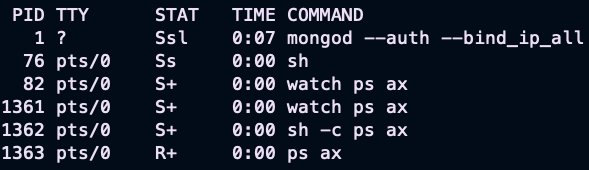

### Docker

#### What is Docker?

- A virtualization software which makes developing and deploying much easier.
- Packages application with all the necessary dependencies, configuration, system tools.
- Portable artifact, easily shared and distributed.

Docker **standardized process** of running any service on **any** local dev environment.

It is easy to run different version of the same app without any conflict.


#### Docker vs Virtualization

Operating system has 2 main layer: Kernel and Application layer.
Kernel "talks" with hardware and software components.

**Docker** will virtualize the Application layer , **Virtualization** will the Kernel and the OS as well.



Docker images smaller, faster to start. Linux based Docker image is not compatible with Windows OS, but
Virtualization is.

**Solution**: Docker Desktop uses a Hypervisor layer with lightweight Linux distro.

#### Install Docker

Follow the steps:

- https://www.docker.com/get-started/
- https://docs.docker.com/desktop/

#### Docker Image

- Easily shareable and movable
- Like zip, jar, war file but contains not just the codes, but **complete environment configuration**.
- Add environment variables, create directories, files etc..
- Image versioning called: **tags**

#### Docker Container

- Actually starts the application
- A running instance of an image
- We can start multiply containers from 1 image.
- "immutable infrastructure" : only-redeploy containers, never change

#### Docker CLI commands:

- docker images : It shows all images on the computer
- docker pull **imageName** : Pulls down the given image from dockerhub
- docker run **{name}:{tag}** : Creates container from the given image:tag. (If the image not available in locally it
  will pull from DockerHub)
- docker build : Build image fom specific Dockerfile
- docker ps / docker container ls : Shows running containers
- docker ps -a / docker container ls -a : Shows all container
- docker image ls :  Images that are currently available on your system and a container created from it.
- docker image ls -a: Shows all image
- docker stop **{containerId}** : Stops given container
- docker log **{containerId}** : Shows logs for the given container.
- docker container inspect mysql : Shows all information about the container
- docker container stats : streaming live performance for all container
- docker container port **{containerName}** : Shows publishing ports HOST:CONTAINER

**Flags:**

- -d / --detach: run at the background
- -p {port}:{port} :
- --name {chosenContainerName} : You can name your new container.
- --network {chosenNetworkName} :

### Docker/Host Port

The application runs in an **isolated Docker network** in the container.
We need to expose the container port to make the service available to the outside world.


### Shell inside Container

- docker container run -it : Start new container interactively
- docker container exec -it : Start existing container interactively

### Docker Networks (Concepts)

A Docker network is a communication channel that allows containers to communicate with each other or with the outside
world.

By default, each container in Docker has its own network stack and IP address, but Docker networks allow containers to
be connected to a shared network.


- CLi commands:
    - docker network ls : shows network
    - docker network inspect : inspect a network
    - docker network create --driver : create a network
    - docker network connect : attach a network to a container
    - docker network disconnect : detach a network from container

#### Default security:

- Your apps (frontend/backend) sit on the same docker network
- Their inner-communication never leaves host
- All externally exposed ports closed by default
- You must manually expose port `-p` -> Better default security

#### DNS - How containers find each other

Docker daemon has a build-in DNS (Domain Name System) server that containers use by default.
DNS allows containers to use domain names to communicate with each other instead of IP addresses.

This allows for easier communication between containers and can help to abstract away network details from containerized
applications.

### Dockerfile

Dockerfiles start from a parent image / **base image**. Example: [LINK](https://hub.docker.com/_/openjdk)

**Example Dockerfile**: Linux based so, We do not have to install it.

```dockerfile

ENV JAVA_VERSION openjdk:11:latest <- Varibale

FROM ${JAVA_VERSION}  <- BASE IMAGE 
ADD build/libs/JARNAME.jar JARNAME.jar <- Copy application file to the container. FROM to TO
ENTRYPOINT ["java", "-jar", "JARNAME.jar"] <- The command executed when the container is started.
```

### Docker Volumes

A Docker volume is a way to store and manage data in Docker containers.

Volumes provide a persistent storage solution for containers, allowing data to be shared and persisted even if
the container is deleted or recreated.

Volumes can be used to share data between multiple containers, back up or migrate data, and enable stateful applications
to run in Docker containers.
Volumes can be created and managed using Docker CLI or Docker Compose.

We can name our volumes with flag:

In case of mysql:

- -v **{volumeName}**:/var/lib/mysql

### Bind Mounting

Maps a host file/directory to a container file or directory.

This allows for files on the host system to be accessible and writable by the container, and changes made in the
container are reflected on the host system.

Bind mounts are useful for sharing files between the host system and container, allowing for easy development and
testing of code without having to rebuild the container image each time a change is made. 

