# Swarm and Kubernetes

#### Orchestration

In the context of Kubernetes, orchestration refers to the automated management and coordination of containerized
applications across a cluster of servers.

It involves tasks such as deployment, scaling, monitoring, and resiliency.
Kubernetes orchestrates containers, ensuring they are scheduled to run on appropriate nodes, managing their lifecycle,
and providing mechanisms for load balancing and fault tolerance.

By handling these tasks, orchestration simplifies the
management and scaling of containerized applications, making them more reliable and efficient.

Automate tasks like:

- Deployment containers
- Scaling
- Resource allocations
- Load Balancing
- Health monitoring
- etc.

### Swarm

Docker Swarm is a native clustering and orchestration tool for Docker containers. It allows developers to manage a
cluster of Docker nodes and deploy and scale applications across them.

Docker Swarm provides features such as load
balancing, service discovery, rolling updates, and self-healing for containerized applications.

It allows for easy scaling of applications and automatic distribution of containers across multiple nodes in the
cluster. Docker Swarm also
supports integration with other Docker tools such as Docker Compose and Docker Registry.

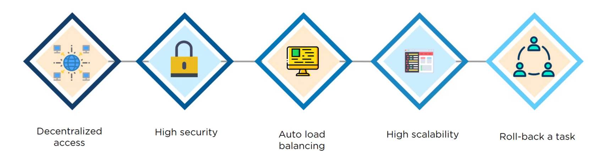

2 types of Node:

- Manager node : Maintains cluster management tasks:
    - Accepting commands and creating service objects
    - Allocating IP addresses to tasks
    - Assigning tasks to nodes
    - Instructing a worker to run a task
- Worker Node : Receive and execute tasks **from** manager node

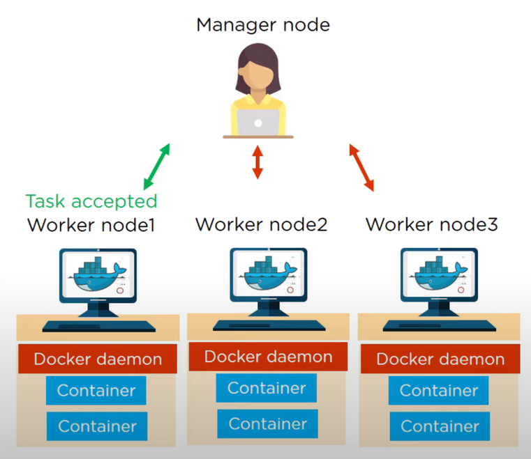

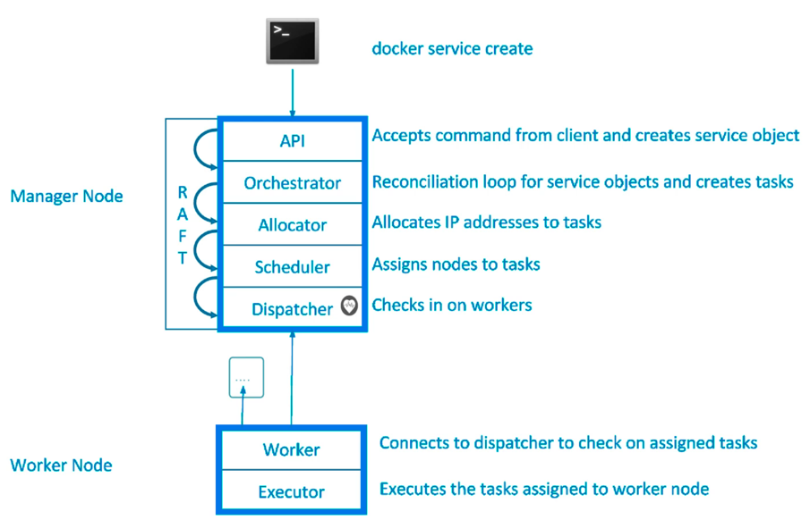

#### Create Manager/Master Node and join a Worker under that

| Command                                                       | Note                            |
|---------------------------------------------------------------|---------------------------------|
| docker swarm init --advertise-addr <master-node-ip>           | Create cluster with master node |
| docker swarm join --token < token > <master-node-ip>:< port > | Join to cluster as worker node  |
| docker swarm join-token worker                                | Show join-token again           |
| docker node ls                                                | Check nodes in the cluster      |
| docker swarm leave --force                                    | WorkerNode leave the cluster    |
| docker node rm <node-id>                                      | Remove node from cluster        |

#### Swarm CLI commands:

`docker service COMMAND` : replace docker run command.

      - docker service create ping 8.8.8.8: Swarm will create the image. For example, Alpine, which will ping the
        Google DNS server.
      - docker service ls: Lists services.
      - docker service ps {serviceName/serviceId}: Shows tasks/containers in the service.
      - docker service update {serviceName/serviceId} --replicas {number}: Creates the given number of replicas from the given
        service.
      - docker service rm {serviceName}: Removes the service and all tasks/containers under it.
      - docker node update --role manager {nodeName} - promote worker node to manager

Example command:
`docker service create --name new_nginx --replicas 3 -p 80:80 nginx:latest`

Read more: [LINK](https://docs.docker.com/engine/swarm/services/)

### Swarm Deploy from YML:

`Stack` function makes use of YML files to deploy multiple services at once.

`docker stack deploy -c <yaml-filename>.yml <stack-name>`

[Example yaml](../../../../resources/kubernetes/swarm-example.yml)

___

#### Overlay Networking : Scaling out our virtual network

The overlay network enables communication between containers running on different nodes in a swarm cluster. It creates a
virtual network overlay on top of the physical network infrastructure, allowing containers to communicate with each
other as if they were on the same network segment, regardless of their actual physical location.

Commands under: [Docker Networks (Concepts)](../docker/README.md/#docker-networks-concepts)

to create use this flag: --driver overlay {imageName}

#### Routing Mesh

Docker routing mesh is a built-in load balancing solution in Docker Swarm mode that allows traffic to be automatically
and dynamically distributed among replicas of a service.

The load balancer built-in to the overlay networking driver will do this job out of the box.
VIP: Virtual ip address

#### Swarm lock, unlock, autolock, backup

- `Autolock`:
  Autolock is a feature that automatically applies a lock to a resource after a certain condition or event occurs. It is
  commonly used to enhance data security by preventing unauthorized access or modifications. For example, a file in the
  Swarm network can be set to autolock after a certain period of inactivity or when a specific event triggers the
  locking mechanism. This helps ensure that sensitive data remains protected even if users forget to manually lock it.


- `Lock`:
  In the context of Swarm, lock refers to a mechanism that restricts access to a particular resource, such as a file or
  a piece of data stored in the Swarm network. When a resource is locked, it means that it cannot be modified or
  accessed by other users or processes until it is unlocked.


- `Unlock`:
  Unlocking is the process of removing the lock from a resource, thereby allowing it to be modified or accessed again.
  It grants permission to users or processes to perform operations on the locked resource.


- `BackUp`:
  Docker manager nodes store the swarm state and manager logs in the /var/lib/docker/swarm/ directory. This data
  includes the keys used to encrypt the Raft logs. Without these keys, you cannot restore the swarm.

[Lock LINK](https://docs.docker.com/engine/swarm/swarm_manager_locking/)

[Backup LINK](https://docs.docker.com/engine/swarm/admin_guide/#back-up-the-swarm)
___
### Kubernetes

Features:

- High availability
- Scalability
- Disaster recovery

##### Architecture

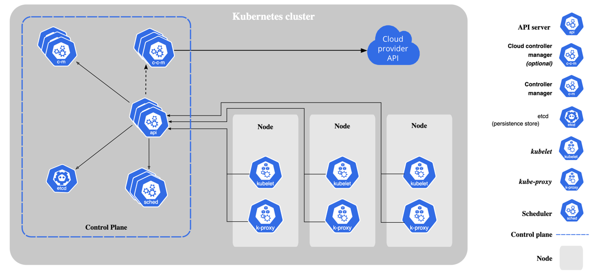

3 process must be installed on every Node!

- Container runtime
- Kubelet : Interacts with the `containers` and the `node`. Starts the pod with a container inside
- KubeProxy : Sort of `load balancer` -> Control request and delegate it to the appropriate service. (If possible within
  the same node)

2 type of nodes:

- `master` :
    - 4 processes run on every master node:
        - `Api server `: With a client, we interact with cluster through api server.

          **cluster gateway, acts as a gatekeeper for authentication.**

        - `Scheduler` : Example request to create a new POD.
          Request arrives to **API Server** and after **Scheduler** gets the request and decide which worker node has
          resource to handle one more POD. (**Important**: Kubelet will start the new POD in the node)

        - `Controller Manager`: Detect cluster state changes. Example:  If **POD** dies in a node, it will detect that
          and reSchedule to create a new one.

        - `etcd`: (cluster brain) key value store about cluster state information. Used for Master node know what is the
          state for Worker Nodes.
          Example: If new POD creation request come in, Scheduler
          will know where to deploy because of etcd.
- `worker(slave)`

[READ MORE](https://kubernetes.io/docs/concepts/overview/components/)

##### Kubernetes base objects

- <u>POD</u> :

  Pod is the smallest unit of deployment in Kubernetes, representing one or more containers and associated
  resources, such as storage and network settings. It provides a logical grouping for containers that need to coexist
  and communicate with each other. Pods are ephemeral, can be dynamically created or destroyed, and are managed by
  Kubernetes to ensure scalability and availability of applications.

    - Recommended to put 1 container to 1 pod. If we put more than 1 container
      they should be different because of port problems.

    - We should not put 3 layered application into 1 pod.

    - Pod IP address is temporarily. (If pod dies and kubernetes create a new instance ip address will different)

    - Use `YML` file to create pods. Usually we do not create standalone pod.
      We create deployments which create replicaset and pod.

      Yml have 3 parts: metadata, specification(it depends on `kind`), status(it generated by kubernetes and stored in
      etcd)

      Example:

      ```yaml
      apiVersion: v1
      kind: pod
      metadata:
        name: frontend
        labels: 
          tied: frontend
      spec:
        containers:
        - image: nginx:1.17
          name: nginx 
      ```

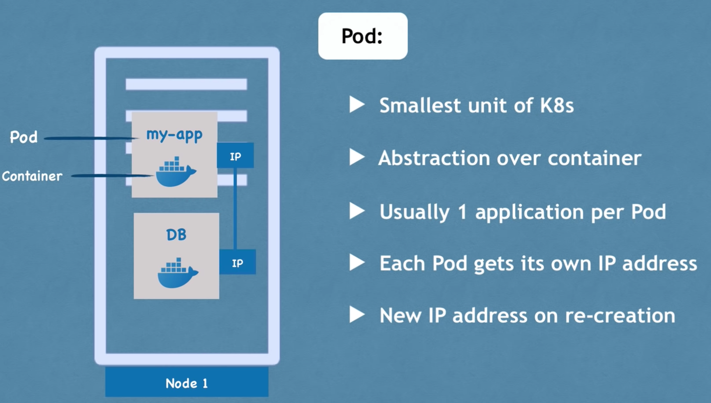

- <u>ReplicaSet</u>:  
  A Kubernetes ReplicaSet is a higher-level abstraction that helps maintain a specified number
  of `identical pod replicas`
  running at all times. It ensures high availability and fault tolerance by automatically scaling the number of replicas
  based on user-defined criteria.

  ReplicaSets allow applications to be replicated and distributed across a cluster,
  ensuring consistent availability and resilience in the event of failures or traffic spikes. They are commonly used to
  manage stateless applications that can be scaled horizontally.

  In the replicas the same `PODS` connect to the same service.

  We can not replicate databases because databases have `STATE`. Shared data storage -> We need some mechanism to avoid
  `data inconsistencies`

    - Use `YML` file to create replicaset.

      Example:

      ```yaml
      apiVersion: apps/v1
      kind: ReplicaSet
      metadata:
        name: frontend
        labels:
          app: guestbook
          tier: frontend
      spec:
        replicas: 3
        selector:
          matchLabels:
            tier: frontend
        template:
          POD YAML!!!!
      ```

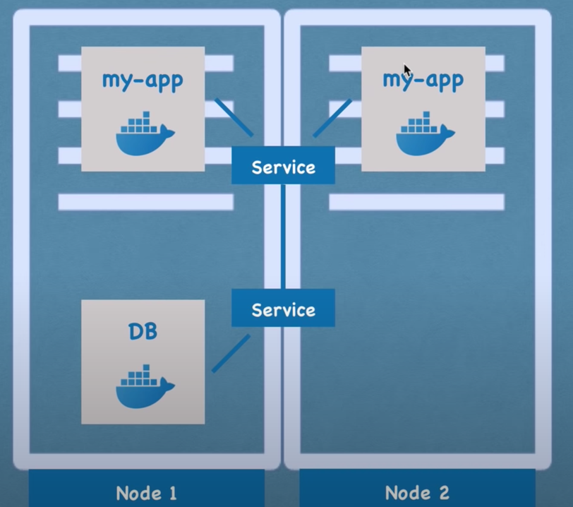

- <u>Deployment</u>:

  A Kubernetes Deployment is a resource object that provides declarative updates and management for pods and
  ReplicaSets.

  It defines the desired state of the application, including the number of replicas, container images, and
  other configuration parameters.

  Deployments facilitate rolling updates, rollbacks, and scaling operations, ensuring
  seamless transitions between different versions of the application. They provide a higher level of abstraction for
  managing and controlling the lifecycle of applications in Kubernetes.

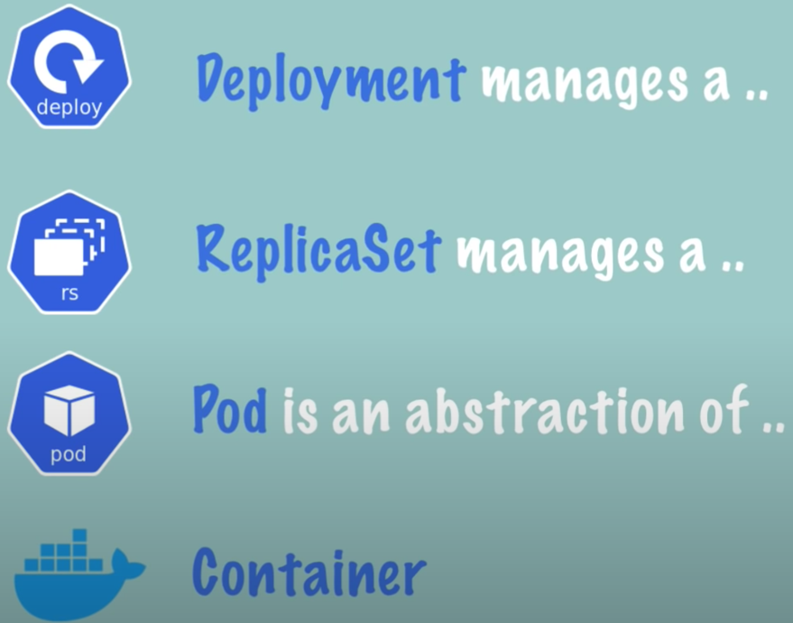

- <u>Service</u> : A collection of pods made accessible as endpoints. It gives us a permanent IP address.

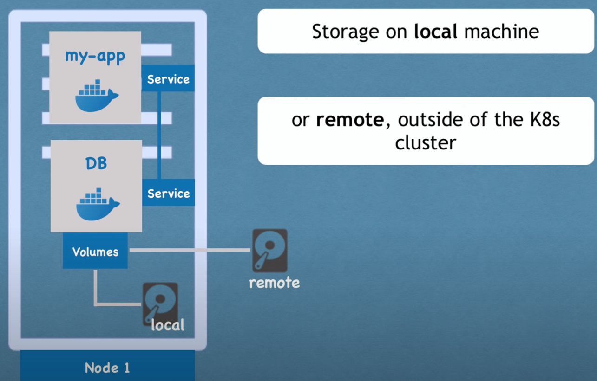

```
Service Types:
- ClusterIp (default) : 
    - Single, internal virtual IP allocated
    - Only reachable from within cluster (nodes and pods)
    - Pods can reach service on apps port number
- Nodeport:
    - High port allocated on each node
    - Port is open on every node's IP
    - Anyone can connect (if they can reach node)
- Loadbalancer:
    - Controls a LB endpoint external to the cluster
    - Only available when infra provider gives you a LB
    - Creates NodePort+ClusterIP services, tells LB to send to a NodePort
- ExternalName
    - Adds CNAME DNS record to CodeDNS Only
    - Not used for Pods, but for given pods a DNS name to use for something outside K8.
- Ingress: See later
```

- <u>Ingress</u> : It represents an externally accessible HTTPS endpoint. Request to the server going to
  ingress, and ingress will forward the request to the Service.

    - Use `YML` file to create replicaset.

      Example:

      ```yaml
      apiVersion: networking.k8s.io/v1beta1
      kind: Ingress
      metadata:
        name: myapp-ingress
      spec:
        rules:
        - host: myapp.com # It has to be valid url
          http:
            paths:
            - backend: 
                serviceName: myapp-internal-service
                servicePort: 8080
      ```

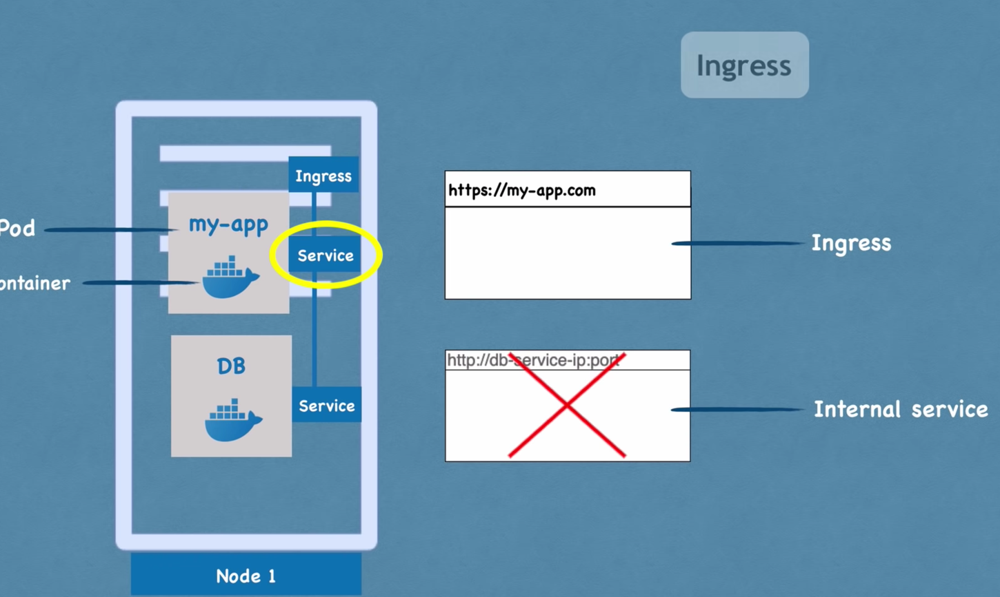

We have to apply(install) Ingress Controller Pod. Many third party implementations.

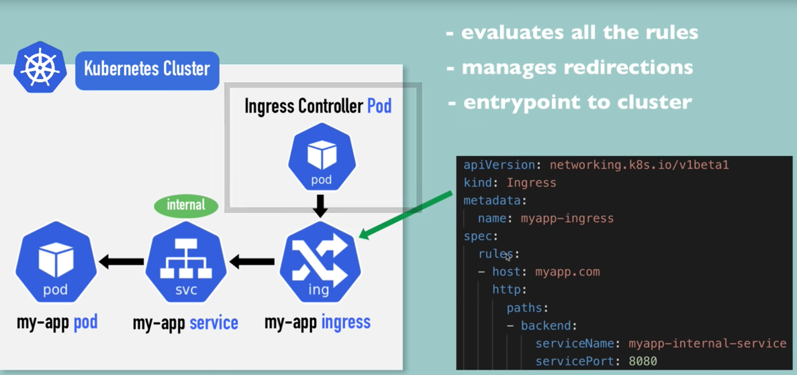

- <u>Volumes</u> : Should store data outside the container -> Local or remote
- <u>ConfigMap</u> : External configuration to the application. If we change something in it, we
  don't need to re-create the PODs.  (Do not put username and password here - plain text)

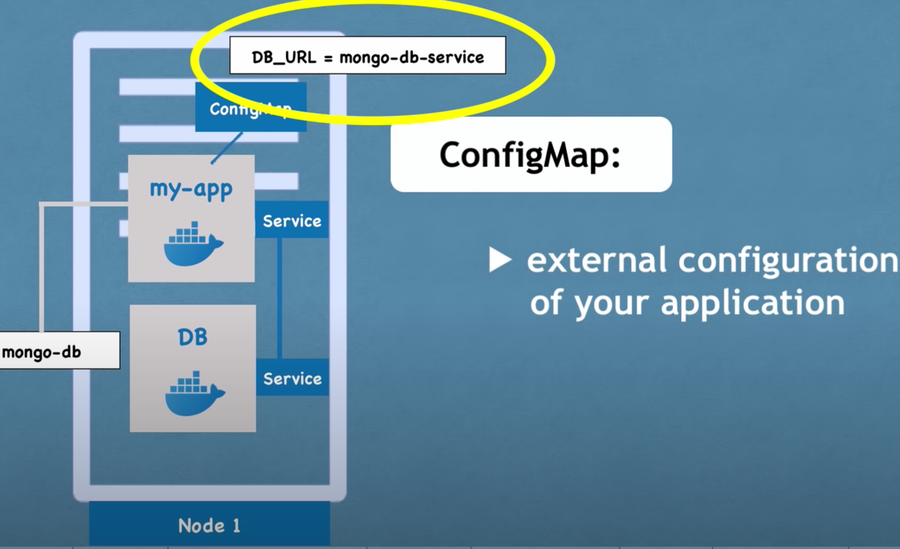

- <u>Secret</u> : base64 encoded -> easy to decode.

##### Environment variables:

We can give variables 3 way:

````yaml

env: # Give value
- name: DEMO_GREETING
  value: "Hi There"

env: # Hide behind secret
- name: SECRET_USERNAME
  valueFrom:
    secretKeyRef:
      name: secretName
      key: username

env: # From config file
- name: LOG_LEVEL
  valueFrom:
    configMapKeyRef:
      name: env-config
      key: log_level
````

##### Namespaces:

Kubernetes namespaces are a way to logically divide and isolate resources within a cluster.

They provide a virtual environment that allows different teams or projects to coexist within the same Kubernetes cluster
without interfering with each other.

If we use the default namespace and two team have same deployment name and config yaml. One of them will overwrite the others config.

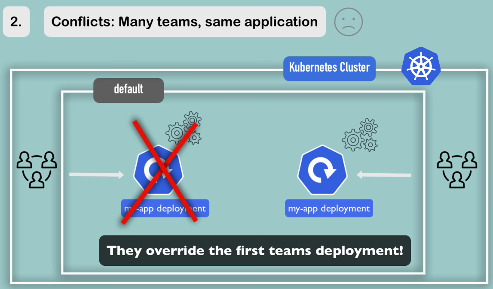


Namespaces offer resource segregation, access control, and better resource management by providing a
scope for naming resources such as pods, services, and deployments.

They enable efficient multi-tenancy and help
organize and manage applications and resources in a more structured manner.

4 base namespaces:

- kube-system : do not modify this! System processes and master and kubectl processes.
- kube-public : publicly accessible data. Configmap: This contains cluster information.
- kube-node-lease : Information about nodes. Determines the availability of a node.
- default : Holds resources if we did not create a new namespace.

We should create namespaces because after a while we won't be able to manage everything in `default` namespace.

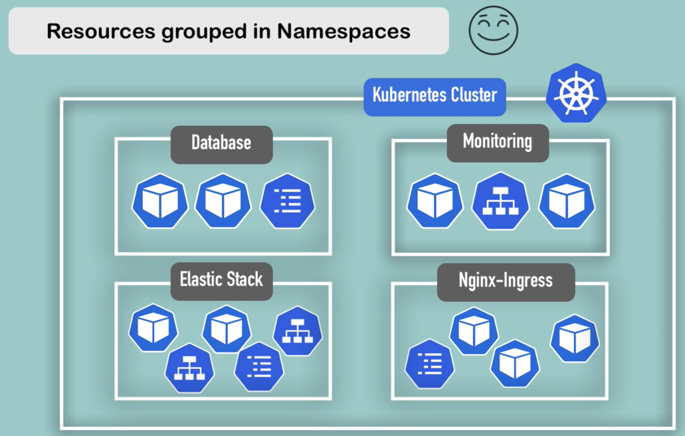


We are able to limit resource usage  by namespace.

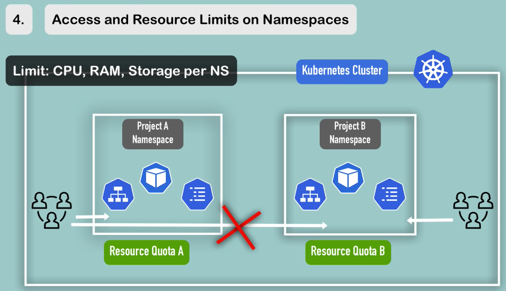

##### Helm:

Kubernetes Helm is a package manager for Kubernetes that simplifies the deployment and management of applications.

It provides a templating engine to define reusable and customizable Kubernetes manifests, called charts.

Helm allows for easy installation, upgrade, and removal of applications, providing versioning, dependency management,
and rollback capabilities.

It streamlines the deployment process and promotes best practices by encapsulating application
configurations and making them easily shareable and reproducible.

Helm Charts is a bundle of YAML Files. We can create our Helm Charts with Helm, and we can push Helm Repository to share
with others.

### Local Testing Kubernet

- Install Minikube

#### Kubectl CLI commands:

- kubectl get nodes/pod/services/replicaset : shows nodes/pod/services/replicaset
- kubectl create HELP - We can create a lot of things. Like deployment BUT recommended way to use YML.
- kubectl apply -f {YML} - kubectl will create cluster raised by YML. ( -f = file)
- kubectl logs {podName} :
- kubectl describe pod {podName} : show what state changes happened in the container
- kubectl exec -it {podName} -- bin/bash : , it establishes a connection to the specified pod, opens an interactive Bash
  shell session, and allows you to directly interact with the container's environment, run commands, and perform various
  tasks within the context of that pod.

`If there is no Ingress to give external ip to our claster we can still open a tunel for testing purpose.`

[OPEN TUNNEL](https://minikube.sigs.k8s.io/docs/handbook/accessing/)