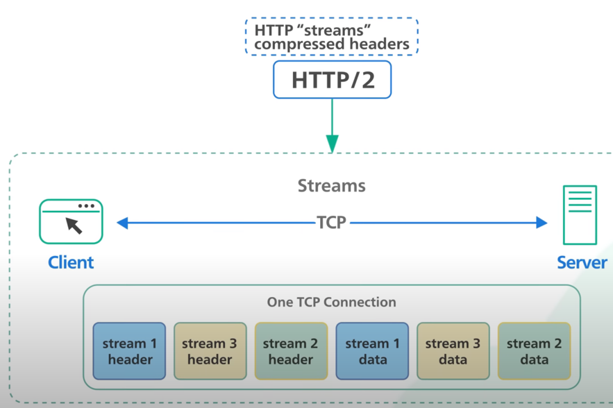
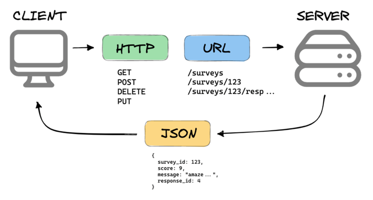
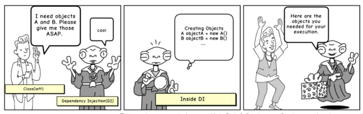
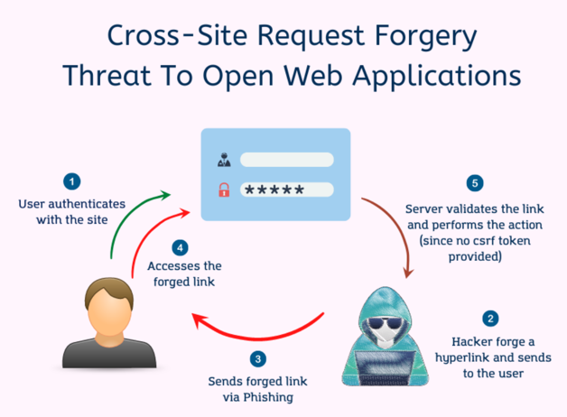
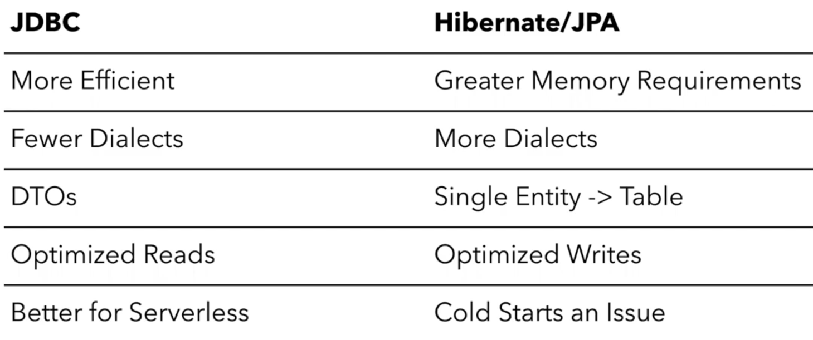
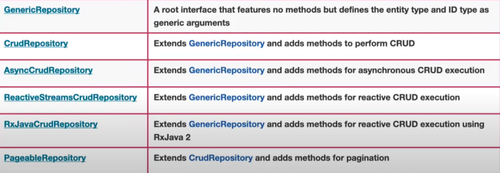

## TCP - Transmission Control Protocol

TCP is a communication protocol that is part of the Internet Protocol Suite. It provides
reliable and ordered delivery of data between two devices over a network.

TCP ensures that data packets sent from one
device are received correctly and in the correct order by the receiving device. It establishes a connection-oriented
communication, meaning that a connection is established between the sender and receiver before data transmission begins.

___

## HTTP

HTTP (Hypertext Transfer Protocol) is an application-layer protocol that operates on top of TCP.

HTTP defines how clients (such as web browsers) request resources from servers and how servers respond to those
requests.

- HTTP 1.1 - 1997 (blocking if a request does not get answer)
- HTTP 2.0 - 2015 (TCP - stream)
- HTTP 3.0 - 2019 (Quick UDP Internet Connections)

#### 1.1 vs 2.0

- <u>**Multiplexing**</u>: HTTP/1.1 loads resources one after the other, so if one resource cannot be loaded, it blocks
  all the
  other resources behind it. In contrast, HTTP/2 is able to use a single TCP connection to send multiple streams of data
  at once so that no one resource blocks any other resource. HTTP/2 does this by splitting data into binary-code
  messages and numbering these messages so that the client knows which stream each binary message belongs to.




- <u>**Server push**</u>: Typically, a server only serves content to a client device if the client asks for it. However,
  this
  approach is not always practical for modern webpages, which often involve several dozen separate resources that the
  client must request. HTTP/2 solves this problem by allowing a server to "push" content to a client before the client
  asks for it. The server also sends a message letting the client know what pushed content to expect – like if Bob had
  sent Alice a Table of Contents of his novel before sending the whole thing.


- <u>**Header compression**</u>: Small files load more quickly than large ones. To speed up web performance, both
  HTTP/1.1 and
  HTTP/2 compress HTTP messages to make them smaller. However, HTTP/2 uses a more advanced compression method called
  HPACK that eliminates redundant information in HTTP header packets. This eliminates a few bytes from every HTTP
  packet. Given the volume of HTTP packets involved in loading even a single webpage, those bytes add up quickly,
  resulting in faster loading.


- <u>**Prioritization**</u>: Prioritization refers to the order in which pieces of content are loaded. Prioritization
  affects a webpage's load time. For example, certain resources, like large JavaScript files, may block the rest of the
  page from loading if they have to load first. More of the page can load at once if these render-blocking resources
  load last. In HTTP/2, developers have hands-on, detailed control over prioritization. This allows them to maximize
  perceived and actual page load speed to a degree that was not possible in HTTP/1.1. HTTP/2 offers a feature called
  weighted prioritization. This allows developers to decide which page resources will load first, every time.


___

### What is REST?

API (Application programming interface) is a way for computers to talk to each other.

[MORE](../softwaredesign/README.md#api)



The most common API standard used by mobile and web application to talk to the servers is called
`REST`.
It stands: **RE**presentational **S**tate **T**ransfer.

<u>**It means when a RESTful API is called, the server will transfer to the client a representation of the state of the
requested resource.**</u>

**REST** is not a specification. It is a new set of rules that has been the common standard to build a
web API since early 2000s.

A REST Application organize resources into a set of unique URLs.

```thymeleafurlexpressions
https://example.com/api/v3/products
https://example.com/api/v3/users
```

Request types:

```
POST -> CREATE 
GET -> READ
PUT -> UPDATE
DELETE -> DELETE
```

A REST implementation should be `STATELESS`!

In a RESTful architecture, the client is typically stateful. The statelessness of REST refers to the server not
maintaining any knowledge of the client's state. However, the client can maintain its own state, such as user session
information or context, between requests.


Advantages:

- `Scalability`: REST APIs are highly scalable because they follow a stateless client-server model. The server does not
  need to maintain any client state between requests, which allows for better horizontal scaling and improved
  performance. This scalability is particularly beneficial when dealing with a large number of concurrent clients or
  high-volume traffic.


- `Flexibility`: REST APIs support various data formats, such as JSON and XML, allowing for flexibility in data
  representation. Clients can request and receive data in the format that best suits their needs. Additionally, REST
  APIs can support multiple media types and content negotiation, enabling the API to adapt to different client
  requirements.


- `Caching`: REST APIs can take advantage of the caching mechanisms provided by the HTTP protocol. Clients can cache API
  responses, reducing the need for frequent requests to the server. Caching improves performance, reduces bandwidth
  usage, and enhances scalability, especially for read-heavy applications.


- `Evolvability`: REST APIs promote loose coupling between the client and server. By using hypermedia-driven
  interactions (**HATEOAS** - Hypermedia as the Engine of Application State), clients can discover and navigate
  resources dynamically, without prior knowledge of the API
  structure.

  This decoupling allows for easier evolution and versioning of the API without breaking existing clients.

___

### Richardson Maturity Model

The maturity of RESTful services based on their architectural constraints and level of adoption of REST principles.

- `Level 0` : The Swamp of POX (Plain Old XML)
  At this level, services are not designed following REST principles. They often use XML as the data format.
  Typically, uses one URI and one kind of method. (POST)

Example: Client -> /message

Create RequestBody:

```xml

<create-message>
    <message-content>Hello World!</message-content>
    <message-author>Nagy Lajos</message-author>
</create-message>
```

Delete RequestBody:

```xml

<delete-message>
    <message-id>30</message-id>
</delete-message>
```

- `Level 1` : Resources
  Level 1 introduces the concept of resources, where each resource has a unique identifier (URI) but still uses 1 HTTP
  method (POST)

Examples:

    - http://www.example.com/products
    - http://www.example.com/product/5687

- `Level 2` : HTTP Verbs
  Level 2 focuses on leveraging the full power of HTTP by utilizing the appropriate HTTP methods (GET, POST, PUT,
  DELETE) for different operations on resources. For each request will get a correct HTTP response code.

Examples:

    - GET http://www.example.com/products
      200 OK

- `Level 3` : Hypermedia Controls
  At Level 3, also known as "HATEOAS" (Hypermedia as the Engine of Application State), the API provides hypermedia
  controls in responses.
  These controls include links and other metadata that guide clients on how to interact with the
  API dynamically. Clients can navigate through the API by following these hypermedia links without prior knowledge of
  the API structure.

Example:

```json
{
  "customerId": "1234",
  "customerName": "Jane",
  "_links": {
    "self": {
      "href": "http://example.com/customers/1234"
    }
  }
}
```


___

# Micronaut

`Micronaut` is a modern, lightweight, and full-stack framework for building microservices and serverless applications in
Java, Kotlin, and Groovy.

Features:

- `Dependency Injection` : Dependency injection is a software design pattern that allows the separation of object
  dependencies from the code that uses them. Instead of creating and managing dependencies within a class, the
  dependencies are provided externally, typically through constructor parameters or setters. This approach promotes
  loose coupling, testability, and flexibility, as different implementations of dependencies can be easily swapped
  without changing the dependent code.



- `Ahead-of-Time` : AoT analyzes the application's code and dependencies at compile time. It performs the compilation
  step
  ahead of time, before the application is actually executed. This means that all the necessary translations and
  optimizations are done in advance. AOT eliminates the need for certain runtime operations, such as reflection and
  dynamic proxies, which can slow down the application.


- `Reactive Support` : Micronaut can take advantage of non-blocking and asynchronous programming techniques. Instead of
  waiting for each task to finish, the program can continue executing other tasks while waiting for the results of
  previous tasks.

  [READ MORE](../reactive/README.md)


- `Cloud-Native Capabilities` : Cloud Computing is a running applications on computing resources managed by cloud
  providers, without having to purchase and manage hardware ourselves.

### ApplicationContext

In the Micronaut Framework, an application context represents the central hub for managing the lifecycle of beans (
components) and handling their dependencies. It provides features like dependency injection, bean instantiation, and
lifecycle management.

The `ApplicationContext` is a higher-level construct that serves as a container or holder for multiple
application context

```java
public class MicronautApp {

    public static void main(String[] args) {
        ApplicationContext context = Micronaut.run(MicronautApp.class);

        String[] beans = context.getBeanDefinitionNames(); // Shows all beans in the container.
    }
}
```

### Dependency Injection (Inversion of Control)

Dependency injection is a core feature of the framework that allows objects to be created and wired together in a
loosely coupled manner, promoting modular design, testability, and maintainability of the codebase.

This is achieved
through the use of an inversion of control (IoC) container, which manages the creation and injection of dependencies at
runtime.

```java

@Controller("/api/content")
public class ContentController {

    private final ContentRepository repository;

    public ContentController(ContentRepository contentRepository) {
        this.repository = contentRepository;
    }
}
```

#### Types:

- `Constructor based Dependency Injection` : This is preferred. ensures that all required dependencies are provided when
  creating an object. It makes dependencies explicit and helps with easy testing and debugging.


- `Setter based Dependency Injection` : Null checks are required, because dependencies may not be set at the moment.


- `Field or Property-based Dependency Injection` : Field injection can make testing difficult since dependencies are not
  explicitly defined in the constructor or setters. It also creates tight coupling between classes, making the code less
  maintainable and harder to understand.

If we hava an injection (interface for example) with more than one implementation,
we can tell micronaut to use one of them with `@Qualifier`.

Example:

```java

public interface PaymentGateway {
    // ...
}

@Singleton
@Qualifier("paypal")
public class PaypalGateway implements PaymentGateway {
    // ...
}

@Singleton
@Qualifier("stripe")
public class StripeGateway implements PaymentGateway {
    // ...
}

@Singleton
public class PaymentService {
    private final PaymentGateway paymentGateway;

    @Inject
    public PaymentService(@Qualifier("paypal") PaymentGateway paymentGateway) {
        this.paymentGateway = paymentGateway;
    }

    // ...
}
```

## Bean

A bean is an object whose lifecycle is managed by the Micronaut Framework's inversion of control (IoC) container.
The IoC container is responsible for creating and managing objects (beans) in an application and injecting their
dependencies. That lifecycle may include creation,
execution, and destruction.

- `Bean Definition`:
  At this stage, Micronaut scans the application's classpath and identifies classes annotated with bean-related
  annotations such as @Singleton, @Prototype, or @Controller. These annotations indicate that the classes should be
  managed as beans by the Micronaut dependency injection system.


- `Bean Initialization`:
  Once a bean is defined, Micronaut creates an instance of the bean and performs constructor injection and property
  injection based on the dependencies declared in the bean class. Dependencies can be autowired using annotations like
  @Inject or @Value.


- `Bean Post-Initialization`:
  After the dependencies are injected, Micronaut invokes any methods annotated with @PostConstruct. These methods are
  used
  for any additional setup or initialization logic required by the bean. They are executed after the bean's dependencies
  have been injected but before the bean is ready for use.


- `@PostConstruct` and `@PreDestroy ` are used to define lifecycle callbacks for beans. These annotations allow you to
  execute specific code after its initialization (@PostConstruct) or before the destruction of a bean (@PreDestroy).

TheBeanContext abstraction which allows for dependency injection of classes annotated with `@Inject`.

To look up the beans you can use:

```java
final BeanContext context=BeanContext.run();
        CLAZZ clazz=context.getBean(CLAZZ);
```

If a class implements an interface, other class can choose to either inject the interface or the concrete
implementation.

To avoid this, we can use `@Bean(typed = CLAZZ)` annotation to limit the exposed types.

```java

@Singleton
@Bean(typed = Engine.class)
public class V8Engine implements Engine {
    @Override
    public String start() {
        return "Starting V8";
    }

    @Override
    public int getCylinders() {
        return 8;
    }
}
```

(If we try to create a `V8Engine` it will throw NoSuchBeanException exception)

### Scopes:

- `Singleton` : Beans with singleton scope are created only once per application context and are shared across all
  beans.

  ```java
  
  @Singleton
  public class RobotFather {
      private final Robot robot;
  
      public RobotFather(Robot robot) {
          this.robot = robot;
      }
  
      @NonNull
      public Robot child() {
          return this.robot;
      }
  }
  ```

- `Prototype` : a new instance of the bean is created each time it is injected. It is a synonym for `@Bean` because the
  default scope is prototype.

  ```java
  //Bean
  @Prototype
  public class MyPrototypeBean {
      private final String name;
  
      public MyPrototypeBean(String name) {
          this.name = UUID.randomUUID().toString();
      }
  
      public String getName() {
          return name;
      }
  }
  ```

  ```java
  //2 service
  @Singleton
  public class MyService1 {
      private final MyPrototypeBean prototypeBean;
  
      @Inject
      public MyService(MyPrototypeBean prototypeBean) {
          this.prototypeBean = prototypeBean;
      }
  
      public void doSomething() {
          System.out.println("Name from prototype bean: " + prototypeBean.getName());
      }
  }

  @Singleton
  public class MyService2 {
      private final MyPrototypeBean prototypeBean;
  
      @Inject
      public MyService(MyPrototypeBean prototypeBean) {
          this.prototypeBean = prototypeBean;
      }
  
      public void doSomething() {
          System.out.println("Name from prototype bean: " + prototypeBean.getName());
      }
  }
  ```

Each service will receive its own unique instance of MyPrototypeBean. Therefore, the output of the doSomething()
method in each service will be different.

```java
Name from prototype bean:e9d8520e-1d55-4c8f-9786-6fb65c2fe5f1
        Name from prototype bean:4d9e7f7e-3517-487a-bfe6-971c6f2187b9
```

- `RequestScope` - scope representing bean with lifecycle associated with the HTTP request, requires an HTTP module


- `ThreadLocal` : is a custom scope that associates a bean per thread via a ThreadLocal.


- `Context` : a bean is created at the same time as the ApplicationContext


- `Infrastructure` : Infrastructure scope represents a bean that cannot be overridden or replaced using @Replaces
  because it is critical to the functioning of the system.


- `Refreshable` : a custom scope that allows a bean’s state to be refreshed via the /refresh endpoint or Publication of
  a RefreshEvent.

  ```java
  
  @Refreshable
  public static class WeatherService {
      private String forecast;
  
      @PostConstruct
      public void init() {
          forecast = "Scattered Clouds " + new SimpleDateFormat("dd/MMM/yy HH:mm:ss.SSS").format(new Date());// (2)
      }
  
      public String latestForecast() {
          return forecast;
      }
  }
  ```

[Documentation](https://docs.micronaut.io/latest/guide/#scopes)
[BLOG](https://piotrminkowski.com/2019/04/15/micronaut-tutorial-beans-and-scopes/)
___

#### @Introspected

To figure out a bean properties the old ways:

```java
BeanInfo info=Introspector.getBeanInfo(JavaBean.class );
```

This is an old reflection based solution.

With `@Introspected` annotation

```java
BeanIntrospection<JavaBean> introspection=BeanIntrospection.getIntrospection(javaBean.class );
```

The @Introspected annotation is used to automatically generate code that can inspect and manipulate objects at runtime.
It tells the Micronaut framework to analyze a particular class and generate code to handle it more easily.
Reflection free Micronaut solution.

**Extra**:

The ApplicationContext extends a BeanContext and adds the concepts of configuration, environments.
The entry point for IoC is the Application context interface, which includes a run method.

___

### Micronaut Configuration

- Server Configuration : By default, Netty runs on 8080. We can configure it in `application.yml`

```yaml
micronaut:
  server:
    port: 8100
```

- Logging Configuration : Specifies the logging level for a specific package or class.

```yaml
logging:
  level:
    io.micronaut: DEBUG
    org.example: INFO
  config: classpath:logback.xml
```

- Data Source Configuration :

```yaml
datasources:
  default:
    url: jdbc:mysql://localhost:3306/mydatabase
    username: myuser
    password: mypassword
```

- HTTP Client Configuration : Various properties to configure the behavior of the HTTP client, such as timeouts,
  connection pool settings, etc.

```yaml
micronaut:
  http:
    client:
      my-client:
        connect-timeout: 5000
        read-timeout: 10000
```

If we want to change one of the property later on, and we don't want to rebuild a jar, we are able to override it:

- Create an application.yml next to a jar. Run the jar it will grap the original yml and after it will notice the
  external yml.
- CLI argument can override application.yml -> key values

```yaml
java -jar micronaut-0.0.1-snapshot.jar --micronaut.server.port=9090
```

- System properties

___

### Micronaut Validation

Our goal to validate early as possible (controller layer).

Micronaut has a build in validation framework (package `javax.validation`) or/and Micronaut has another validation
library, for that we should first include the following dependencies to our `pom.xml`:

```xml

<dependency>
    <groupId>io.micronaut</groupId>
    <artifactId>micronaut-validation</artifactId>
</dependency>
<dependency>
<groupId>io.micronaut.configuration</groupId>
<artifactId>micronaut-hibernate-validator</artifactId>
</dependency>
```

- @Validated will validate parameters on class level.
  It means that all method parameters within this class will be subject to validation.
  You can use Micronaut-specific validation annotations like @IntRange, @Email, etc., or custom validation rules for
  method parameters, query parameters, and path variables.

```java
import java.util.Collections;

@Validated // (1)
@Controller("/email")
public class EmailController {

    @Get("/send")
    public HttpResponse send(@NotBlank String recipient, // (2)
                             @NotBlank String subject) { // (2)
        return HttpResponse.ok(Collections.singletonMap("msg", "OK"));
    }
}
```

- @Valid on method level. It is used to indicate that the Email object passed as the request body should be validated
  using standard Java Bean Validation annotations.
  

```java

import java.util.Collections;

@Introspected
public class Email {

    @NotBlank
    String subject;

    @NotBlank
    String recipient;

}
```

```java

@Validated
@Controller("/email")
public class EmailController {

    @Post("/send")
    public HttpResponse send(@Body @Valid Email email) {
        return HttpResponse.ok(Collections.singletonMap("msg", "OK"));
    }
}
```

Extra: We may configure validation using URI templates. The annotation @Get("/{id:4}") indicates that a variable can
contain 4 characters max (is lower than 10000).

Micronaut is a modern JVM-based framework for building microservices and serverless applications. When it comes to
validation, Micronaut provides support for data validation using annotations from the `javax.validation` package. Here
are some of the most common Micronaut validation annotations:

- `@NotNull`: This annotation is used to mark a field or parameter as not nullable.


- `@NotBlank`: It is used to validate that a string field or parameter is not null or empty and contains at least one
  non-whitespace character.


- `@Size`: This annotation is used to validate the size of a collection, array, or string field or parameter. It can
  specify the minimum and maximum size allowed.


- `@Min` and `@Max`: These annotations are used to validate that a numeric field or parameter is greater than or equal
  to a minimum value (`@Min`) or less than or equal to a maximum value (`@Max`).


- `@Pattern`: This annotation is used to validate that a string field or parameter matches a specific regular expression
  pattern.


- `@Email`: It is used to validate that a string field or parameter represents a valid email address.

These are some of the commonly used validation annotations in Micronaut. There may be other annotations available
depending on the specific needs and dependencies of your application.

___

## Security

We have to include dependency for security:

```xml

<dependency>
    <groupId>io.micronaut</groupId>
    <artifactId>micronaut-security</artifactId>
</dependency>
```

and enable in application yml:

```yaml
micronaut:
  security:
    enabled: true  # Specifies whether security is enabled in the application.
    anonymous: # Specifies whether anonymous access is allowed.
      enabled: true
    intercept-url: # Defines the access control for specific URL patterns.
      '/api/public/**': permitAll()
      '/api/private/**': isAuthenticated()
``` 

##### Basic Auth

Once you enable Micronaut security, Basic Auth is enabled by default.

Rules:

- `@Secured(SecurityRule.IS_ANONYMOUS)`
- `@Secured(SecurityRule.IS_AUTHENTICATED)` : If we put this to class level, the whole controller it is available only
  for
  successfully authenticated users. This can be overriden by method level (`@Secured(ADMIN)`).

#### Cross-site request forgery



In a CSRF attack, the attacker crafts a malicious website or an email containing a link to a malicious website. When the
victim visits this website, it may contain hidden code or scripts that make requests to the targeted website on behalf
of the victim. These requests can be actions like changing account settings, making purchases, or even initiating
financial transactions, depending on the privileges of the victim's account.

To defend against CSRF attacks, web developers can implement various countermeasures:

Using `anti-CSRF tokens`: Developers can include unique, random tokens in each form or request that modifies data on the
website. These tokens are validated on the server side to ensure that the request originated from a legitimate source.

### HTTPS

Micronaut by default starts the server with disabled SSL. However, it supports HTTPS out of the box.

[Documentation](https://micronaut-projects.github.io/micronaut-security/latest/guide/)
[BLOG](https://piotrminkowski.com/2019/04/25/micronaut-tutorial-security/)

___

### Test

`@MicronautTest` is running your REAL application and starts the application context and injects all the beans.

@MicronautTest annotation will replace this kind of repetitive code.

```java
@Test
public void testHelloEndpoint(){
        EmbeddedServer server=ApplicationContext.run(EmbeddedServer.class);
        HttpClientConfiguration configuration=server.getApplicationContext().getBean(HttpClientConfiguration.class);
        HttpClient client=RxHttpClient.create(server.getURL(),configuration);

        HttpRequest<?> request=HttpRequest.GET("/hello");
        String response=client.toBlocking().retrieve(request);
        assertEquals("Hello World",response);
        }
```

Pros:

- Automatic start/stop EmbeddedServer (refers to the server that was started up for this test suite) and
  ApplicationContext.
- Automatic Bean Injection
- @MockBean : his annotation tells Micronaut to replace the bean of type `CLAZZ` with a mock implementation.
- TestPropertyProvider
- @Property

Cons:

- Everything is automatic -> Less Control.

___

### Object-relational mapping : ORM

The idea behind it: We can convert an object to a row in a database.

The `JPA` (Java Persistence API) specification is a Java specification that defines a standard way to manage relational
data in Java applications. It provides a set of interfaces, classes, and annotations that outline the rules and
guidelines for Object-Relational Mapping (ORM) in Java.

`Hibernate` is an open-source object-relational mapping (ORM) framework that implements the JPA specification. It is one
of the most widely used implementations of JPA and provides additional features beyond what is specified by JPA.
Hibernate simplifies the development of database-driven applications by handling the mapping between Java objects and
database tables automatically.

Useful annotation:

- @Entity(name="something") :  The name attribute in the @Entity annotation is used to specify the name of the entity in
  the database.

  By default, Hibernate will use the name of the Java class as the entity name in the database.


- @GeneratedValue : s used in Hibernate to specify the strategy for generating primary key values for entities.


- @Column(length=1000) : length = 1000 means that the corresponding column can store up to 1000 characters or bytes (
  instead of 255 base length), depending on the underlying database's character encoding.


- @Column(columnDefinition = "TEXT") : Change the column definition from `VARCHAR` to `TEXT`. Text can hold any length
  of characters.

### Micronaut Data

`Spring Data` rely heavily on reflection and compute queries at runtime -> cost of computation grows as your application
grows.

`Micronaut Data` is a database access toolkit that uses Ahead of Time (AoT) compilation to pre-compute queries for
repository interfaces. A thin, lightweight runtime layer executes those queries.

- Precomputes Queries at compilation time
- Uses Micronaut`s reflection-free AOT
- Zero runtime overhead database access solution
- Compilation time checking (instead of findByName you write findByLami and Lami field not exist in the **ENTITY** it
  will throw an
  exception)
- Smaller stack traces : Helps debugging.

Two types of Micronaut Data:

- `Micronaut Data JPA`
    - Support for Hibernate / JPA
    - Precomputes JPA-QL queries
    - Many dialect
    - Still leans on reflection / runtime proxies
    - Write heavy
    - Uses `@Repository` annotation


- `Micronaut Data JDBC`
    - Support for native JDBC
    - Pure Data mapper (not an mapping tool!)
    - Focused on DTOs and immutability
    - Lighter weight
    - Reflection and proxy free
    - Read heavy
    - Uses `@JdbcRepository(dialect="something")`



Repository interfaces:



### SQL s JPQL

SQL is a powerful and flexible query language for interacting with relational databases at a low level, while JPQL is a
higher-level language specific to JPA and object-oriented models. JPQL provides a more object-oriented approach to
querying and works with entities and relationships defined in the ORM framework.

SQL:

- Syntax : SQL is a standard query language used to interact with relational databases. It has a specific syntax and set
  of
  keywords for performing operations like selecting, inserting, updating, and deleting data.

- Database vs. Object-Relational Mapping : SQL operates directly on the database tables, columns, and rows. It is a
  powerful and flexible language that allows
  you to perform complex operations and aggregations on the database level.

- Portability : SQL is a widely supported and standard query language that can be used with various databases. However,
  each database may have its own specific dialect and extensions, leading to some differences in syntax and behavior.

JPQL:

- Syntax : JPQL is a query language specific to Java Persistence API (JPA) and is designed to work with object-oriented
  models.
  JPQL syntax is similar to SQL but with some differences to accommodate object-oriented concepts.

- Database vs. Object-Relational Mapping : JPQL operates at a higher level of abstraction. It works with entities, their
  attributes, and relationships defined in the object-relational mapping (ORM) framework, such as Hibernate. JPQL
  queries are translated
  into SQL queries by the JPA provider, which handles the mapping between objects and the database.

- Portability: JPQL is specific to JPA and is designed to be database-agnostic. It allows you to
  write queries that can be executed on different databases without modification, as long as the underlying JPA provider
  supports the database.