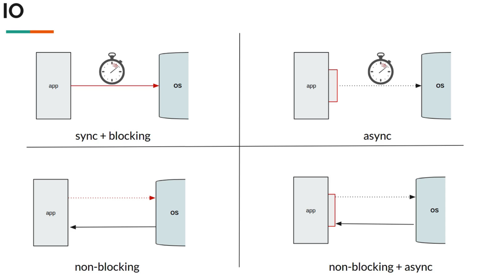
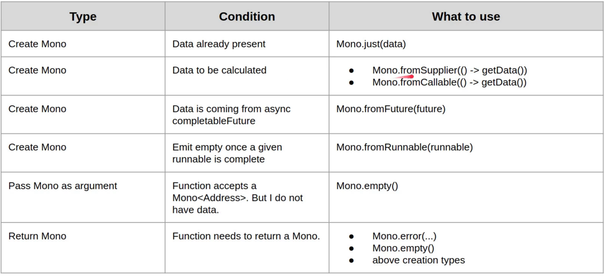
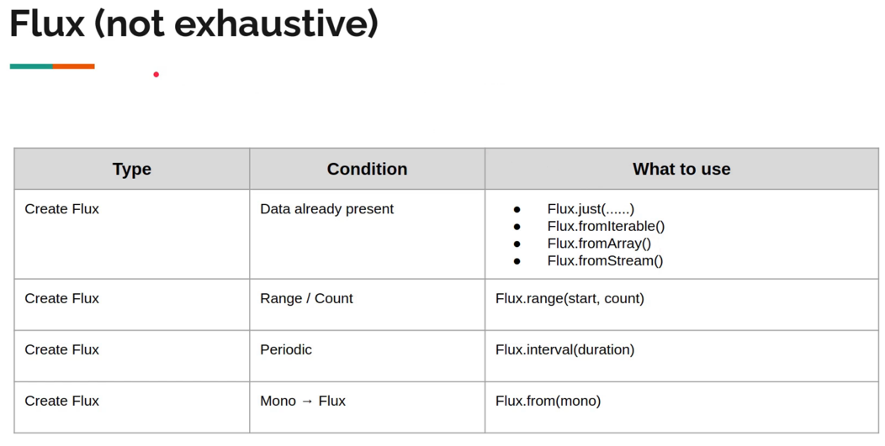

### Reactive Programming

<u>Examples analogy</u>:

- **Sync+blocking**:If I call a company, and it put me hold.
- **Async**: If I ask my friend to call the same company. They put him to hold, but I can work.
- **Non-blocking**: I call the company, they will know my phone number, and they will call me back, so I don't need to
  wait.
- **Non-blocking+async**: Ask a friend to call the company, but register for call back. So he does not need to wait as
  well.

Reactive programming gives us an abstraction to read and write like **sync+blocking** code but behind a *
*Non-blocking+async** happens.

#### Terminologies

- Publisher
    - Source
    - Observable
    - Upstream
    - Producer
- Subscriber
    - Sink
    - Observer
    - Downstream
    - Consumer

Reactor Publisher has 2 implementation:

1. Mono
2. Flux

### Mono

- It emits **0 or 1** item
- Followed by an onComplete / onError.

#### Why use mono?

If we definitely know we are waiting 1 thing from publisher.

[Example basic codes](mono)

### Flux

- It emits **0 or N** item
- Followed by an onComplete / onError.

### Flux - Emitting Items Programmatically

- create
- generate
- push
