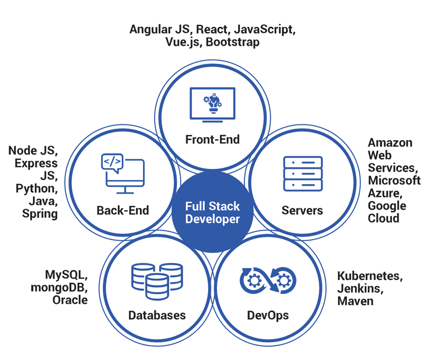

## N-tier architecture

It is a software architectural pattern that divides an application into multiple tiers(layers), each responsible for
specific functionality. This approach helps to separate concerns, improve scalability, and promote reusability and
maintainability in complex systems.

In a multi-tiered architecture, the application is typically divided into three main tiers or layers:

- `Presentation Tier` (or User Interface Tier): This is the topmost layer, responsible for presenting the user interface
  and handling user interactions. It can include components like web browsers, mobile apps, or desktop clients. The
  presentation tier interacts with the underlying layers to retrieve and display data to the user.

- `Business Logic Tier` (or Application Tier): The business logic tier contains the core functionality and processing
  logic of the application. It handles tasks such as data validation, business rules, and workflow management. This
  layer is
  responsible for processing and manipulating data received from the presentation tier before passing it to the data
  storage layer.

- `Data Storage Tier` (or Data Access Tier): The data storage tier is responsible for managing data persistence and
  retrieval. It includes databases, file systems, or any other data storage mechanisms. This layer provides the
  necessary
  infrastructure to store, retrieve, and manipulate data requested by the application.


`Tiers` refer to the physical separation of functionality into distinct layers within an application,
typically involving presentation, business logic, and data storage tiers.

`Layers` refer to the logical separation of components within a single tier, emphasizing modular organization and
separation of concerns within that tier.

## SOA - Service-Oriented Architecture

#### SOAP - Simple Object Access Protocol

Simple Object Access Protocol (SOAP) is a lightweight XML-based protocol that is used for the exchange of information in
decentralized, distributed application environments.

Sample Call

```xml
  POST /StockQuote HTTP/1.1
        Host: www.stockquoteserver.com
        Content-Type: text/xml;
        charset="utf-8"
        Content-Length: nnnn
        SOAPAction: "Some-URI"
        <?xml version="1.0"?>
<SOAP-ENV:Envelope
        xmlns:SOAP-ENV="http://schemas.xmlsoap.org/soap/envelope/"
        SOAP-ENV:encodingStyle="http://schemas.xmlsoap.org/soap/encoding/">
    <SOAP-ENV:Body>
        <m:GetLastTradePrice xmlns:m="Some-URI">
            <symbol>DIS</symbol>
        </m:GetLastTradePrice>
    </SOAP-ENV:Body>
</SOAP-ENV:Envelope>
```

Sample Response

```xml
HTTP/1.1 200 OK
        Content-Type: text/xml;
        charset="utf-8"
        Content-Length: nnnn
        <?xml version="1.0"?>
<SOAP-ENV:Envelope
        xmlns:SOAP-ENV="http://schemas.xmlsoap.org/soap/envelope/"
        SOAP-ENV:encodingStyle="http://schemas.xmlsoap.org/soap/encoding/"/>
<SOAP-ENV:Body>
<m:GetLastTradePriceResponse xmlns:m="Some-URI">
    <Price>34.5</Price>
</m:GetLastTradePriceResponse>
</SOAP-ENV:Body>
        </SOAP-ENV:Envelope>
```

#### SOA

SOA, or service-oriented architecture, is a mechanism for integrating multiple larger components, typically
applications, together so they form an interoperable suite.

Each component typically performs a complete piece of business logic from start to finish, usually involving a variety
of specific tasks and functions needed to complete an entire larger action. Components are typically loosely coupled but
this is not a requirement of the SOA architecture patterns.


[READ MORE](https://medium.com/@SoftwareDevelopmentCommunity/what-is-service-oriented-architecture-fa894d11a7ec)

## Full Stack Application

A full-stack application encompasses both the front-end and back-end components of a
system. It means that the application is developed to work on both the client-side (front-end) and the server-side (
back-end) of the software architecture.

`Front-end` development often involves technologies like HTML, CSS, and JavaScript, as well as frameworks and libraries
like React, Angular, or Vue.js. The front-end is responsible for presenting data to users and handling their
interactions.

`Back-end` of a full-stack app involves the server-side development that powers the application behind the scenes. It
includes managing data, implementing business logic, handling requests, and communicating with databases and external
services.



## API

`Application programming interface`

APIs are mechanisms that enable two software components to communicate with each other using a set of definitions and
protocols. For example, the weather bureau’s software system contains daily weather data. The weather app on your phone
“talks” to this system via APIs and shows you daily weather updates on your phone.

APIs define how different software components should interact, specifying the types of requests that can be made, the
format of the data that is exchanged, and the actions or responses that can be expected.

- SOAP
- REST
- RPC
- Websocket

[READ MORE](https://aws.amazon.com/what-is/api/)

## Microservices

Microservices are an architectural and organizational approach to software development where software is composed of
small independent services that communicate over well-defined APIs. These services are owned by small, self-contained
teams.


Microservices architectures make applications easier to scale and faster to develop, enabling innovation and
accelerating time-to-market for new features.

