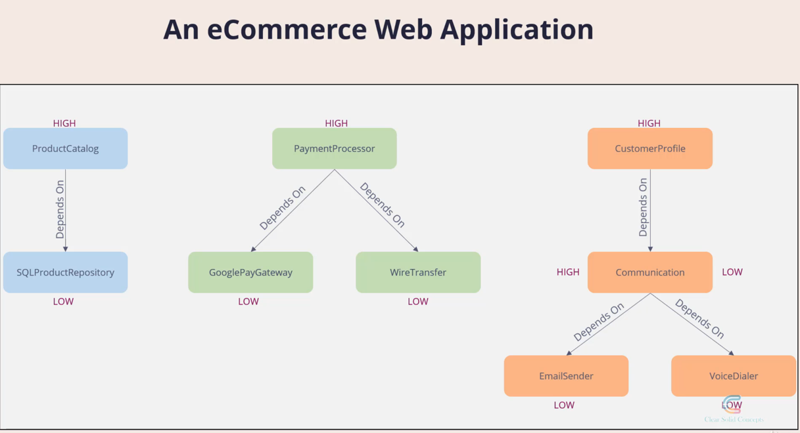
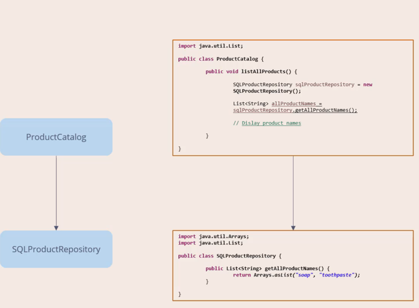
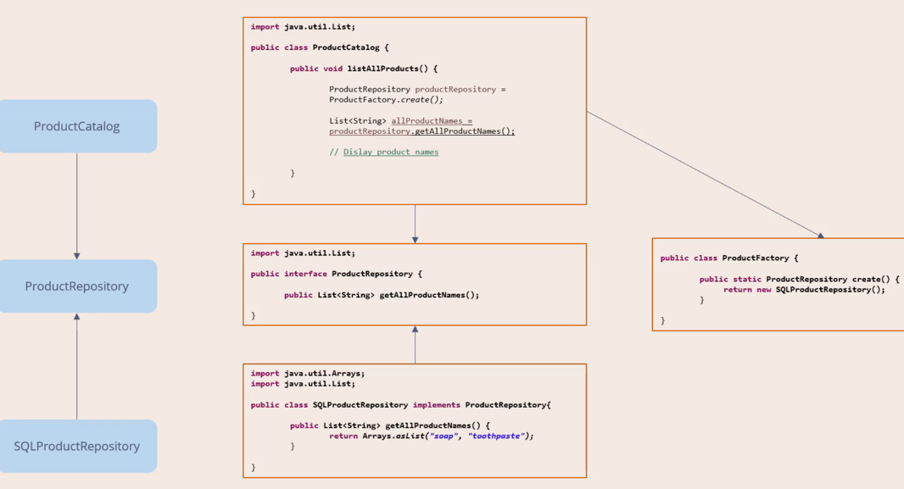
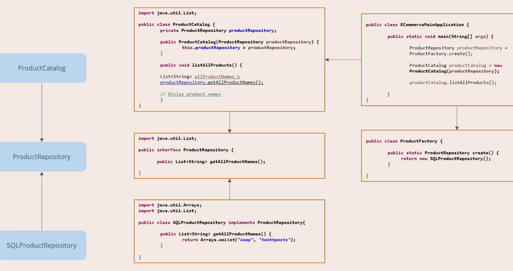

### Dependency Inversion Principle 

- High-level modules should not depend on low-level modules. Both should depend on abstractions. 
- Abstractions should not depend on details. Details Should depend on abstractions. 

This is not good. High level is depend on low level.

With code:

With this modification we do not violate the principle:

