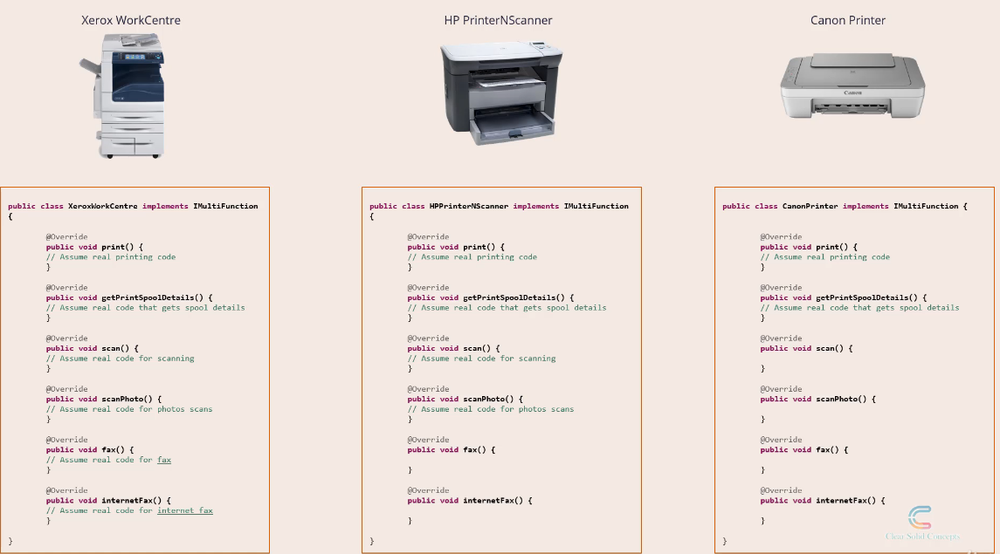
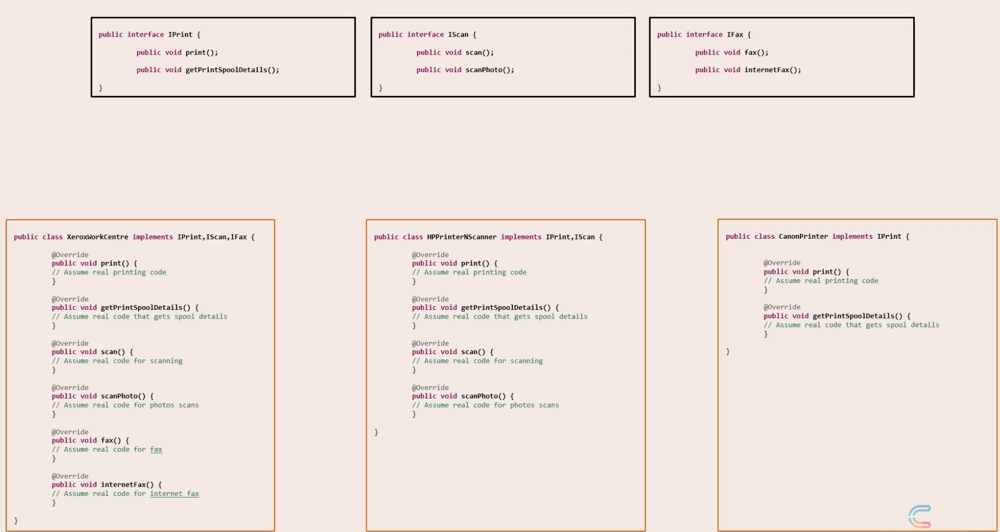

### Interface Segregation Principle

No client should be forced to depend on methods it does not use.

Canon Printer implement fax scan methods even printer can not to these.

Solution:
- Segregate the interfaces.

