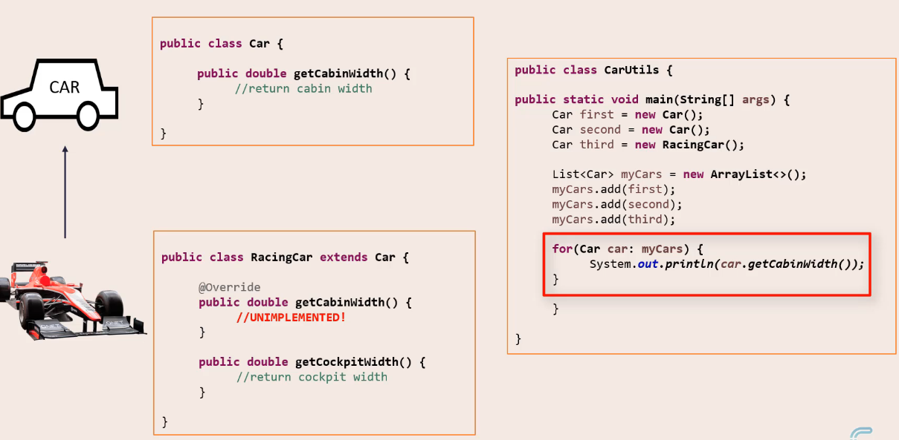
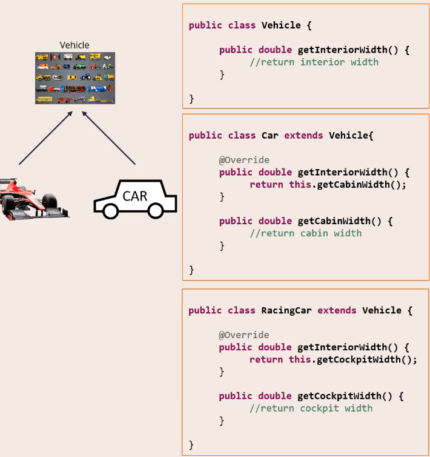
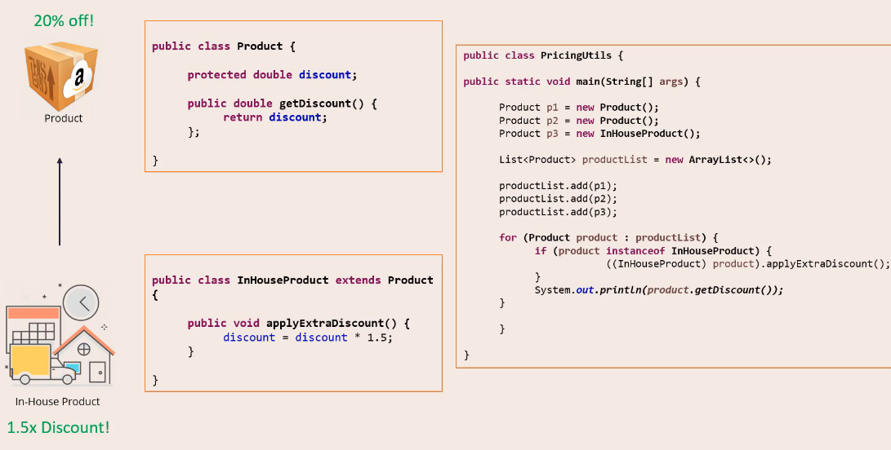
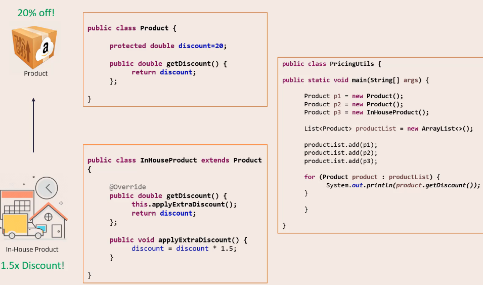

### LSP - Liskov Substitution Principle

Objects should be replaceable with their subtypes without affecting the correctness of the program.

Hidden problems here with the bird.
- Bird can fly but Ostrich can not fly. So LSP

Another example:

  
- The third iteration will fail.

How we can fix this?
- Break the hierarchy.
- Introduce a new "parent"(vehicle).

  

One more:

  

How we can fix this?
- "Tell, do not ask".

