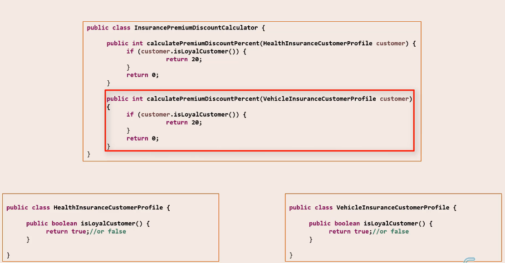

### OCP - Open-Close Principle

Software components should be close for modification, but open for extension.

**Closed for:**
New features getting added to the software component,
should NOT have to modify existing code.

**Open for:**
A component should be extendable to add a new feature or
to add a new behavior to it. 

This is not good practise. If we want to add new insurance we have to modify the discount calculator.

Better if we introduce an interface.

Benefits:
- Easier to add new features.
- Leads to minimal cost of developing and testing software.