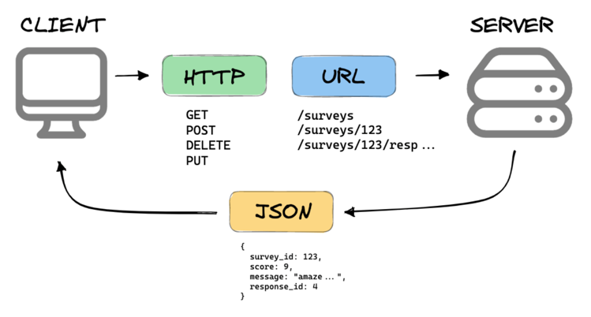
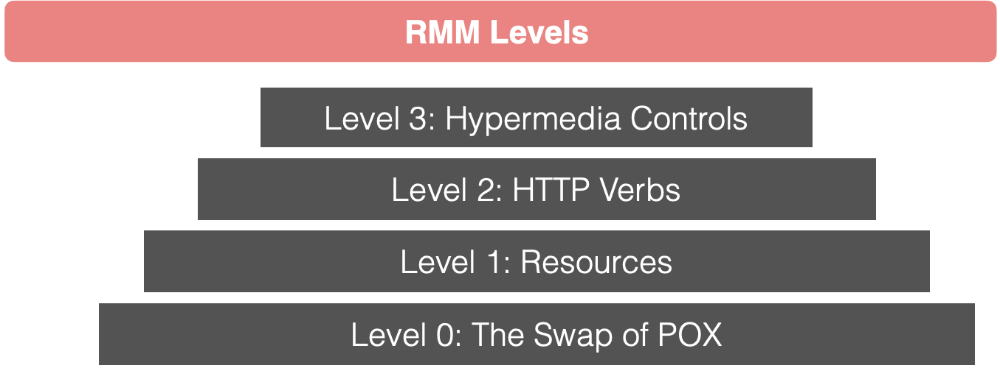
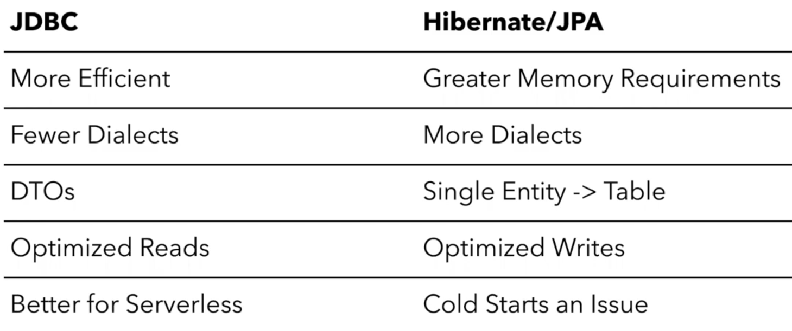
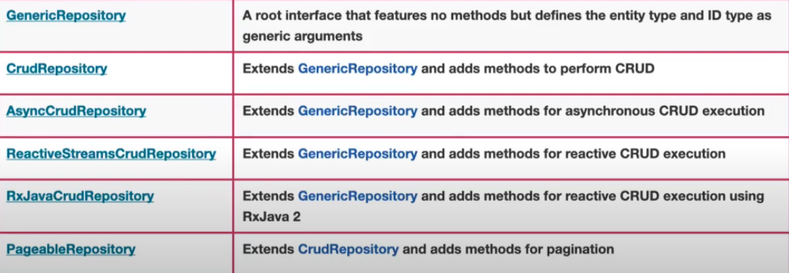

### What is REST?

API (Application programming interface) is a way for computers to talk to each other.



The most common API standard used by mobile and web application to talk to the servers is called
`REST`.
It stands: **RE**presentational **S**tate **T**ransfer.

**REST** is not a specification. It is a new set of rules that has been the common standard to build a
web API since early 2000s.

A REST Application organize resources into a set of unique URLs.

```thymeleafurlexpressions
https://example.com/api/v3/products
https://example.com/api/v3/users
```

Request types:

```
POST -> CREATE 
GET -> READ
PUT -> UPDATE
DELETE -> DELETE
```

A REST implementation should be `STATELESS`!

In a RESTful architecture, the client is typically stateful. The statelessness of REST refers to the server not
maintaining any knowledge of the client's state. However, the client can maintain its own state, such as user session
information or context, between requests.


Advantages:

- `Scalability`: REST APIs are highly scalable because they follow a stateless client-server model. The server does not
  need to maintain any client state between requests, which allows for better horizontal scaling and improved
  performance. This scalability is particularly beneficial when dealing with a large number of concurrent clients or
  high-volume traffic.


- `Flexibility`: REST APIs support various data formats, such as JSON and XML, allowing for flexibility in data
  representation. Clients can request and receive data in the format that best suits their needs. Additionally, REST
  APIs can support multiple media types and content negotiation, enabling the API to adapt to different client
  requirements.


- `Caching`: REST APIs can take advantage of the caching mechanisms provided by the HTTP protocol. Clients can cache API
  responses, reducing the need for frequent requests to the server. Caching improves performance, reduces bandwidth
  usage, and enhances scalability, especially for read-heavy applications.


- `Evolvability`: REST APIs promote loose coupling between the client and server. By using hypermedia-driven
  interactions (HATEOAS), clients can discover and navigate resources dynamically, without prior knowledge of the API
  structure. This decoupling allows for easier evolution and versioning of the API without breaking existing clients.

___

### Richardson Maturity Model

The maturity of RESTful services based on their architectural constraints and level of adoption of REST principles.

- Level 0: The Swamp of POX (Plain Old XML)
  At this level, services are not designed following REST principles. They often use XML as the data format.
  Typically, uses one URI and one kind of method. (POST)

Example: Client -> /message

Create RequestBody:

```xml

<create-message>
    <message-content>Hello World!</message-content>
    <message-author>Nagy Lajos</message-author>
</create-message>
```

Delete RequestBody:

```xml

<delete-message>
    <message-id>30</message-id>
</delete-message>
```

- Level 1: Resources
  Level 1 introduces the concept of resources, where each resource has a unique identifier (URI) and can be accessed
  using simple HTTP methods such as GET, POST, PUT, and DELETE.
  However, the communication style is still predominantly RPC-based, and the resources may not fully utilize the
  capabilities of the HTTP protocol.
  Still uses a single method (POST)


  _RPC: Remote Procedure Call is a software communication protocol that one program can use to request a service from a
  program located in another computer on a network without having to understand the network's details. RPC is used to
  call other processes on the remote systems like a local system. A procedure call is also sometimes known as a function
  call or a subroutine call._

  Examples:

    - http://www.example.com/product/1234
    - http://www.example.com/product/5687


- Level 2: HTTP Verbs
  Level 2 focuses on leveraging the full power of HTTP by utilizing the appropriate HTTP methods (GET, POST, PUT,
  DELETE) for different operations on resources.
  It emphasizes the use of self-descriptive messages and hypermedia links (HATEOAS)
  to enable clients to discover and navigate the API dynamically.


- Level 3: Hypermedia Controls
  At Level 3, also known as "HATEOAS" (Hypermedia as the Engine of Application State), the API provides hypermedia
  controls in responses.
  These controls include links and other metadata that guide clients on how to interact with the
  API dynamically. Clients can navigate through the API by following these hypermedia links without prior knowledge of
  the API structure.

Example:
```json
{
  "customerId" : "1234",
  "customerName" : "Jane",
  "_links" : {
    "self" : {
      "href" : "http://example.com/customers/1234"
    }
  }
}
```



___

## Micronaut

`Micronaut` is a modern, lightweight, and full-stack framework for building microservices and serverless applications in
Java, Kotlin, and Groovy.

Features:

- Dependency Injection
- Ahead-of-Time : AoT analyzes the application's code and dependencies at compile time.
- Reactive Support
- Cloud-Native Capabilities

### Bean

A bean is an object whose lifecycle is managed by the Micronaut IoC container. That lifecycle may include creation,
execution, and destruction.

- `Bean Definition`:
  At this stage, Micronaut scans the application's classpath and identifies classes annotated with bean-related
  annotations such as @Singleton, @Prototype, or @Controller. These annotations indicate that the classes should be
  managed as beans by the Micronaut dependency injection system.


- `Bean Initialization`:
  Once a bean is defined, Micronaut creates an instance of the bean and performs constructor injection and property
  injection based on the dependencies declared in the bean class. Dependencies can be autowired using annotations like
  @Inject or @Value.


- `Bean Post-Initialization`:
  After the dependencies are injected, Micronaut invokes any methods annotated with @PostConstruct. These methods are
  used
  for any additional setup or initialization logic required by the bean. They are executed after the bean's dependencies
  have been injected but before the bean is ready for use.


- `@PostConstruct` and `@PreDestroy ` are used to define lifecycle callbacks for beans. These annotations allow you to
  execute specific code after its initialization (@PostConstruct) or before the destruction of a bean (@PreDestroy).

TheBeanContext abstraction which allows for dependency injection of classes annotated with `@Inject`.

To look up the beans you can use:

```java
final BeanContext context=BeanContext.run();
        CLAZZ clazz=context.getBean(CLAZZ);
```

If a class implements an interface, other class can choose to either inject the interface or the concrete
implementation.

To avoid this, we can use `@Bean(typed = CLAZZ)` annotation to limit the exposed types.

```java

@Singleton
@Bean(typed = Engine.class)
public class V8Engine implements Engine {
    @Override
    public String start() {
        return "Starting V8";
    }

    @Override
    public int getCylinders() {
        return 8;
    }
}
```

(If we try to create a `V8Engine` it will throw NoSuchBeanException exception)

Scopes:

- `Singleton` : singleton pattern for bean
- `Prototype` : a new instance of the bean is created each time it is injected. It is a synonym for `@Bean` because the
  default scope is prototype.
- `ThreadLocal` : is a custom scope that associates a bean per thread via a ThreadLocal
- `Context` : a bean is created at the same time as the ApplicationContext
- `Infrastructure` : the @Context bean cannot be replaced
- `Refreshable` : a custom scope that allows a bean’s state to be refreshed via the /refresh endpoint

[Documentation](https://docs.micronaut.io/latest/guide/#scopes)
[BLOG](https://piotrminkowski.com/2019/04/15/micronaut-tutorial-beans-and-scopes/)

Extra:

The ApplicationContext extends a BeanContext and adds the concepts of configuration, environments.
The entry point for IoC is the Application context interface, which includes a run method.

___

### Micronaut Configuration

- Server Configuration : By default, Netty runs on 8080. We can configure it in `application.yml`

```yaml
micronaut:
  server:
    port: 8100
```

- Logging Configuration : Specifies the logging level for a specific package or class.

```yaml
logging:
  level:
    io.micronaut: DEBUG
    org.example: INFO
  config: classpath:logback.xml
```

- Data Source Configuration :

```yaml
datasources:
  default:
    url: jdbc:mysql://localhost:3306/mydatabase
    username: myuser
    password: mypassword
```

- HTTP Client Configuration : Various properties to configure the behavior of the HTTP client, such as timeouts,
  connection pool settings, etc.

```yaml
micronaut:
  http:
    client:
      my-client:
        connect-timeout: 5000
        read-timeout: 10000
```

___

### Micronaut Validation

To be able to perform HTTP requests validation we should first include the following dependencies to our `pom.xml`:

```xml

<dependency>
    <groupId>io.micronaut</groupId>
    <artifactId>micronaut-validation</artifactId>
</dependency>
<dependency>
<groupId>io.micronaut.configuration</groupId>
<artifactId>micronaut-hibernate-validator</artifactId>
</dependency>
```

- @Validated will validate parameters on class level.

- @Valid on method level.

```java

@Validated
@Controller("/email")
public class EmailController {

    @Post("/send")
    public HttpResponse send(@Body @Valid Email email) {
        return HttpResponse.ok(Collections.singletonMap("msg", "OK"));
    }
}

```

Extra: We may configure validation using URI templates. The annotation @Get("/{id:4}") indicates that a variable can
contain 4 characters max (is lower than 10000).

Micronaut is a modern JVM-based framework for building microservices and serverless applications. When it comes to
validation, Micronaut provides support for data validation using annotations from the `javax.validation` package. Here
are some of the most common Micronaut validation annotations:

- `@NotNull`: This annotation is used to mark a field or parameter as not nullable.


- `@NotBlank`: It is used to validate that a string field or parameter is not null or empty and contains at least one
  non-whitespace character.


- `@Size`: This annotation is used to validate the size of a collection, array, or string field or parameter. It can
  specify the minimum and maximum size allowed.


- `@Min` and `@Max`: These annotations are used to validate that a numeric field or parameter is greater than or equal
  to a minimum value (`@Min`) or less than or equal to a maximum value (`@Max`).


- `@Pattern`: This annotation is used to validate that a string field or parameter matches a specific regular expression
  pattern.


- `@Email`: It is used to validate that a string field or parameter represents a valid email address.

These are some of the commonly used validation annotations in Micronaut. There may be other annotations available
depending on the specific needs and dependencies of your application.

___

## Security

We have to include dependency for security:

```xml

<dependency>
    <groupId>io.micronaut</groupId>
    <artifactId>micronaut-security</artifactId>
</dependency>
```

and enable in application yml:

```yaml
micronaut:
  security:
    enabled: true  # Specifies whether security is enabled in the application.
    anonymous: # Specifies whether anonymous access is allowed.
      enabled: true
    intercept-url: # Defines the access control for specific URL patterns.
      '/api/public/**': permitAll()
      '/api/private/**': isAuthenticated()
``` 

##### Basic Auth

Once you enable Micronaut security, Basic Auth is enabled by default.

Rules:

- `@Secured(SecurityRule.IS_ANONYMOUS)`
- `@Secured(SecurityRule.IS_AUTHENTICATED)` : If we put this to class level, the whole controller it is available only
  for
  successfully authenticated users. This can be overriden by method level (`@Secured(ADMIN)`).

### HTTPS

Micronaut by default starts the server with disabled SSL. However, it supports HTTPS out of the box.

[Documentation](https://micronaut-projects.github.io/micronaut-security/latest/guide/)
[BLOG](https://piotrminkowski.com/2019/04/25/micronaut-tutorial-security/)

___

### Test

`@MicronautTest` is running your REAL application and starts the application context and injects all the beans.

@MicronautTest annotation will replace this kind of repetitive code.

```java
@Test
public void testHelloEndpoint(){
        EmbeddedServer server=ApplicationContext.run(EmbeddedServer.class);
        HttpClientConfiguration configuration=server.getApplicationContext().getBean(HttpClientConfiguration.class);
        HttpClient client=RxHttpClient.create(server.getURL(),configuration);

        HttpRequest<?> request=HttpRequest.GET("/hello");
        String response=client.toBlocking().retrieve(request);
        assertEquals("Hello World",response);
        }
```

Pros:

- Automatic start/stop EmbeddedServer (refers to the server that was started up for this test suite) and
  ApplicationContext.
- Automatic Bean Injection
- @MockBean : his annotation tells Micronaut to replace the bean of type `CLAZZ` with a mock implementation.
- TestPropertyProvider
- @Property

Cons:

- Everything is automatic -> Less Control.

___

### Micronaut Data

`Spring Data` rely heavily on reflection and compute queries at runtime -> cost of computation grows as your application
grows.

`Micronaut Data` is a database access toolkit that uses Ahead of Time (AoT) compilation to pre-compute queries for
repository interfaces. A thin, lightweight runtime layer executes those queries.

- Precomputes Queries at compilation time
- Uses Micronaut`s reflection-free AOT
- Zero runtime overhead database access solution
- Compilation time checking (instead of findByName you write findByLami and Lami field not exist in the **ENTITY** it
  will throw an
  exception)
- Smaller stack traces : Helps debugging.

Two types of Micronaut Data:

- `Micronaut Data JPA`
    - Support for Hibernate / JPA
    - Precomputes JPA-QL queries
    - Many dialect
    - Still leans on reflection / runtime proxies
    - Write heavy
    - Uses `@Repository` annotation


- `Micronaut Data JDBC`
    - Support for native JDBC
    - Pure Data mapper (not an mapping tool!)
    - Focused on DTOs and immutability
    - Lighter weight
    - Reflection and proxy free
    - Read heavy
    - Uses `@JdbcRepository(dialect="something")`



Repository interfaces:




