<!-- TOC -->

* [Common vocabulary for testing](#common-vocabulary-for-testing)
* [Fundamental concepts of software testing](#fundamental-concepts-of-software-testing)
* [Established techniques for designing tests](#established-techniques-for-designing-tests)
* [Value of testing to stakeholders](#value-of-testing-to-stakeholders)
* [Testing techniques](#testing-techniques)
* [BDD fundamentals with Gherkin](#bdd-fundamentals-with-gherkin)
* [Testing Strategy](#testing-strategy)
* [Difference between unit, integration, functional and non-functional testing](#difference-between-unit-integration-functional-and-non-functional-testing)
* [Extra:](#extra)
    * [V Model:](#v-model)
    * [Iterative Model:](#iterative-model)

<!-- TOC -->

### Common vocabulary for testing

- `Test Case` - A set of instructions, conditions, or requirements used to test a specific feature or functionality
  of a software application.

  Example:
  Check system behavior when valid email id and password is entered.
  Check system behavior when invalid email id and valid password is entered.
  Check system behavior when valid email id and invalid password is entered.
  Check system behavior when invalid email id and invalid password is entered.

- `Test Steps` - Test steps refer to the sequence of actions that are performed in order to execute a test case. They
  typically include the setup of the test environment, the execution of the test case, the observation of the results,
  and the reporting of any defects or issues found.

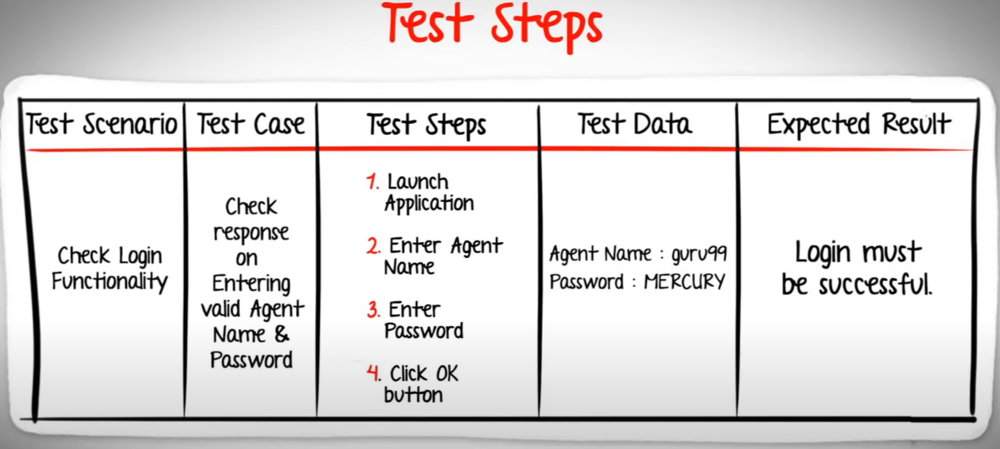

- `Test Suite` - A collection of test cases that are grouped together to test a specific area or function of a
  software application.

- `Test Plan` - A detailed document that outlines the testing approach, goals, objectives, and resources required
  to ensure that the software application meets the desired quality standards.

- `Test Scenario` - A hypothetical situation or use case that is used to test the functionality of a software
  application.

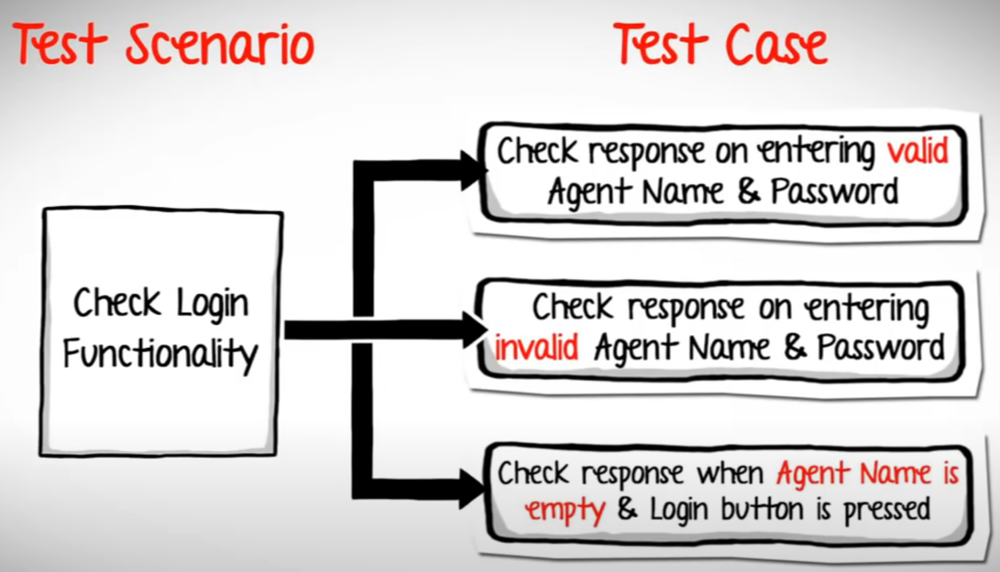

- `Test Script` - A set of instructions that are executed automatically to perform a specific test case or test
  scenario.

- `Test Environment` - The hardware and software infrastructure that is used to execute tests on a software
  application.

- `Test Data` - The input data that is used to execute a test case or test scenario.

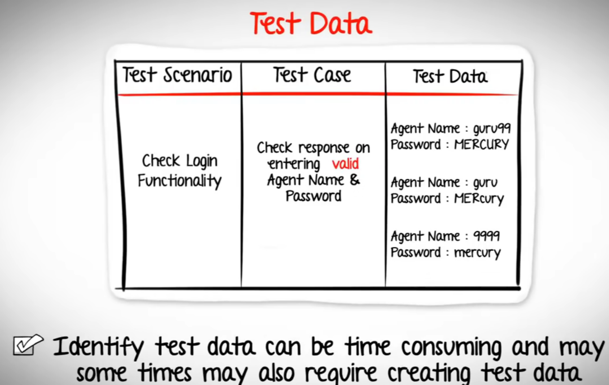

- `Test Result` - The output generated by executing a test case or test scenario, which indicates whether the
  software application passed or failed the test.

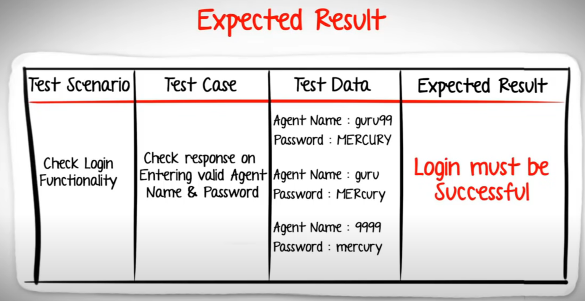

### Fundamental concepts of software testing

- `Testing is an iterative process` - Testing is not a one-time activity but an iterative process that involves repeated
  testing of the software application as new changes and updates are made to it.

- `Testing should begin early in the software development lifecycle` - Testing should be integrated into the software
  development lifecycle from the early stages to ensure that defects are identified and fixed as early as possible.

- `Testing aims to find defects` - The primary objective of testing is to find defects or errors in the software
  application and ensure that they are fixed before the application is released.

- `Testing should be based on requirements` - Testing should be based on the requirements of the software application to
  ensure that it meets the desired quality standards.

- `Testing should be both manual and automated` - Testing can be performed manually by humans or automated using
  software
  tools, and both approaches have their advantages and disadvantages.

- `Test coverage should be comprehensive` - Testing should cover all aspects of the software application, including
  functional, non-functional, and performance aspects, to ensure that it meets the desired quality standards.

- `Testing should be repeatable and consistent` - Testing should be performed in a repeatable and consistent manner to
  ensure that the results are consistent and reliable.

- `Testing should be prioritized` - Testing should be prioritized based on the criticality and impact of the features or
  functions being tested.

- `Test results should be documented` - Test results should be documented to ensure that defects are tracked and fixed,
  and the testing process is improved over time.

- `Testing is not exhaustive` - Testing cannot guarantee that all defects in the software application are identified,
  but
  it can increase the confidence in the quality of the application.

### Established techniques for designing tests

- `Boundary Value Analysis (BVA)` - This technique involves testing the boundaries or limits of input values to ensure
  that the software application handles them correctly. For example, testing how the application handles values just
  below and above a particular limit.

- `Equivalence Partitioning (EP)` - This technique involves dividing the input data into equivalent classes or
  partitions
  and testing each partition to ensure that the application handles all variations of the input data correctly.

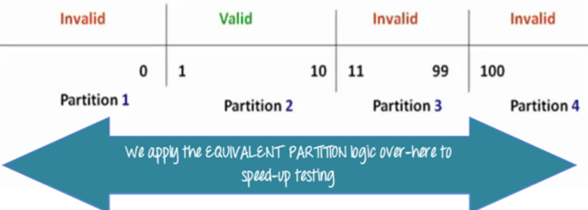

- `Decision Table Testing` - This technique involves creating a table that lists all possible combinations of inputs and
  outputs for a specific feature or function of the software application. The table is then used to design test cases
  that cover all possible scenarios.

Example:

Flight from input, Flight to input, Search button

| Condition       | Rule 1   | Rule 2   | Rule 3   | Rule 4 |
|-----------------|----------|----------|----------|--------|
| Fly From input  | empty    | filled   | empty    | filled |
| Fly To input    | empty    | empty    | filled   | filled |
| Button disabled | disabled | disabled | disabled | active |

- `State Transition Testing` - This technique involves testing the software application's behavior as it transitions
  between different states or modes. For example, testing how the application handles different user inputs when
  transitioning from one screen to another.

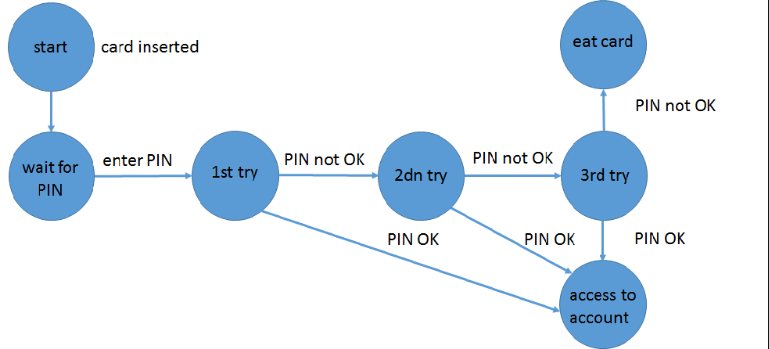

- `Exploratory Testing` - This technique involves exploring the software application's features and functions to
  identify
  defects or errors that may not be identified through other testing techniques. It involves using the software
  application as a user would to identify any unexpected or unusual behavior.

- `Risk-based Testing` - This technique involves identifying and prioritizing the risks associated with different
  features
  or functions of the software application and designing test cases that cover those risks.

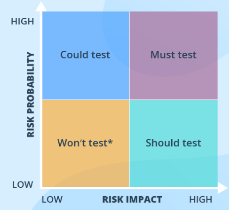

- `Error Guessing` - This technique involves designing test cases based on the tester's intuition and experience to
  identify defects or errors that may not be identified through other testing techniques. It involves imagining
  scenarios that may cause errors and designing test cases to simulate those scenarios.

- `Pairwise Testing` - This technique involves testing all possible combinations of pairs of input parameters to
  identify
  any defects or errors that may not be identified through other testing techniques. It aims to minimize the number of
  test cases required while still achieving comprehensive test coverage.

### Value of testing to stakeholders

Testing is of significant value to stakeholders because it helps to ensure that
a software system meets the desired quality, reliability, and functionality.
Here are some specific benefits of testing for various stakeholders:

- `Developers`: Testing helps developers identify and fix bugs and errors early in the development cycle, which
  ultimately saves time and money. By catching issues early, developers can avoid more complex and costly issues later
  on.

- `Product Owners`: Testing helps product owners ensure that the system meets the desired requirements and
  specifications. Through testing, product owners can gain confidence that the system is ready for release to users.

- `Quality Assurance (QA) Teams`: Testing is the primary responsibility of QA teams. By performing various testing
  techniques, QA teams ensure that the system meets the desired quality and reliability standards, ensuring customer
  satisfaction.

- `Customers`: Testing ensures that the system works as expected, and customers can rely on it to function correctly.
  This builds trust and confidence among customers and can lead to positive word-of-mouth, increased customer retention,
  and increased sales.

- `Management`: Testing helps management ensure that the system meets the desired business goals and objectives, such as
  generating revenue, increasing productivity, or reducing costs. Testing helps management make informed decisions about
  the release of the system, ensuring that it is ready to be deployed in a production environment.

In summary, testing plays a crucial role in ensuring the quality,
reliability, and functionality of a software system,
and stakeholders at all levels benefit from it.

### Testing techniques

There are many different testing techniques that can be used to validate software systems and ensure that they meet the
desired quality standards. Here are some of the most commonly used testing techniques:

- `Black-box testing`: Black-box testing is a technique that focuses on testing the external behavior of the software
  system
  without knowledge of its internal structure or implementation details. This technique is typically used to test the
  functionality of the software system.

- `White-box testing`: White-box testing is a technique that focuses on testing the internal structure and
  implementation of
  the software system. This technique is typically used to test the correctness of the software system's code.

- `Grey-box testing`: Grey-box testing is a technique that combines elements of both black-box and white-box testing.
  This technique is typically used to test the integration between different units of the software system.

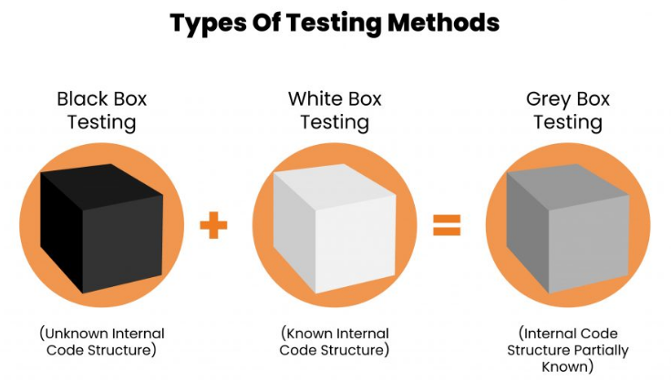

- `Regression testing`: Regression testing is a technique that involves retesting the software system after changes have
  been made to ensure that the changes have not introduced new defects or issues.

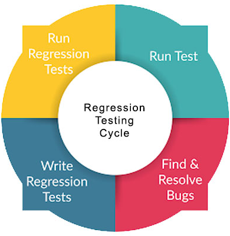

- `Exploratory testing`: Exploratory testing is a technique that involves testing the software system by exploring its
  features and functionality without a predefined test plan. This technique is typically used to identify new defects or
  issues that may not be discovered through other testing techniques.

- `Stress testing`: Stress testing is a technique that involves testing the software system under high load or stress
  conditions to ensure that it can handle heavy usage and still maintain its performance and stability.

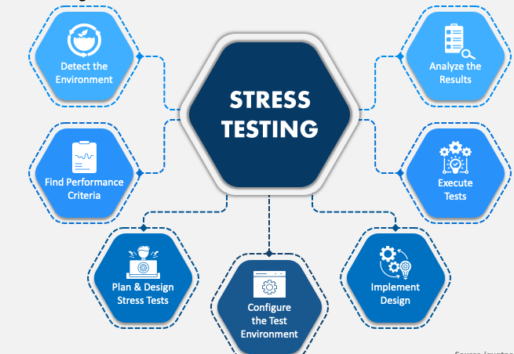

- `Performance testing`: Performance testing is a technique that involves testing the software system's performance and
  scalability under different load and stress conditions.

- `Security testing`: Security testing is a technique that involves testing the software system's security features to
  ensure that it is protected against external threats such as hacking, viruses, and other attacks.

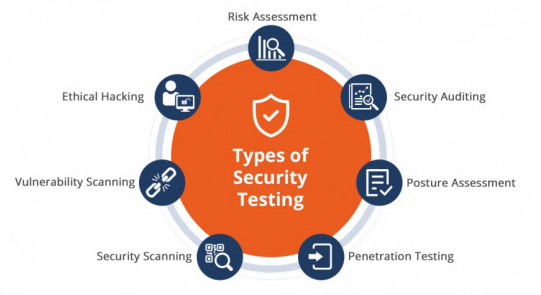

These are just some of the many testing techniques that can be used to validate software systems and ensure that they
meet the desired quality standards. The choice of testing technique will depend on the specific requirements and
objectives of the software system being tested.

### BDD fundamentals with Gherkin

BDD (Behavior-Driven Development) is a software development methodology that aims to improve communication between
stakeholders, including developers, testers, and business analysts, by focusing on the behavior of the software. Gherkin
is a language used in BDD to describe the behavior of the software in a structured, easily readable format. Here are the
fundamental concepts of BDD and Gherkin:

- `Feature`: A feature is a high-level description of the functionality that the software is expected to provide.

- `Scenario`: A scenario is a specific use case that describes how the user interacts with the software and what the
  expected behavior should be.

- `Given-When-Then`: Given-When-Then is a syntax used in Gherkin to describe the behavior of the software. It is
  composed of
  three parts: Given (the preconditions), When (the action taken by the user), and Then (the expected behavior or
  outcome).

- `Background`: A background is a set of preconditions that apply to all scenarios within a feature. It is typically
  used to set up a common environment for all scenarios.

- `Examples`: Examples are used to provide multiple sets of input values for a scenario. They are typically used to test
  the scenario with different inputs and expected outcomes.

- `Tags`: Tags are used to categorize features and scenarios. They can be used to filter tests by category or to
  group tests together.

      Example:

      Feature: Google Searching
      As a web surfer, I want to search Google, so that I can learn new things.
    
      Scenario: Simple Google search
      Given a web browser is on the Google page
      When the search phrase "panda" is entered
      Then results for "panda" are shown

Using Gherkin with BDD allows stakeholders to create a shared understanding of the software's behavior. By describing
the software's behavior in a structured, easily readable format, developers and testers can collaborate more effectively
with business analysts and other stakeholders to ensure that the software meets the desired requirements and
specifications.

### Testing Strategy

A testing strategy is a plan that outlines how testing will be performed on a software system. It typically includes
information about the types of testing that will be performed, the objectives of each type of testing, the testing tools
and techniques that will be used, and the roles and responsibilities of the testing team members. Here are some key
elements of a testing strategy:

- `Testing Objectives`: The testing objectives should be aligned with the goals and requirements of the software system.
  The
  objectives should be specific, measurable, achievable, relevant, and time-bound (SMART).

- `Types of Testing`: The testing strategy should identify the different types of testing that will be performed, such
  as: functional testing, performance testing, security testing, and usability testing.

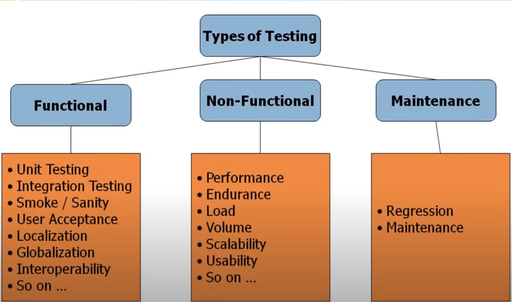

- `Testing Techniques`: The testing strategy should identify the specific testing techniques that will be used for each
  type
  of testing, such as black-box testing, white-box testing, exploratory testing, or regression testing.

- `Test Environment`: The testing strategy should identify the hardware, software, and network configurations needed for
  testing. It should also specify the tools and technologies that will be used to support testing, such as test
  management
  tools, automated testing tools, or defect tracking tools.

- `Test Data`: The testing strategy should identify the test data that will be used to validate the software system. It
  should specify how the data will be generated, stored, and managed, as well as how it will be used for different types
  of testing.

- `Roles and Responsibilities`: The testing strategy should define the roles and responsibilities of the testing team
  members, including testers, developers, project managers, and other stakeholders. It should also specify the
  communication channels and processes that will be used to ensure effective collaboration among team members.

- `Test Metrics`: The testing strategy should identify the key metrics that will be used to measure the success of the
  testing effort, such as defect density, test coverage, and test execution time.

A well-defined testing strategy is essential for ensuring that the software system meets the desired quality,
reliability, and functionality. By outlining the testing objectives, types of testing, testing techniques, test
environment, test data, roles and responsibilities, and test metrics, the testing team can create a comprehensive and
effective testing plan that will help to identify and resolve issues early in the development cycle.

### Difference between unit, integration, functional and non-functional testing

Unit, integration, functional, and non-functional testing are all different types of testing that are performed during
software development to ensure the quality and reliability of the software system. Here are the key differences between
these types of testing:

- `Unit Testing`: Unit testing is the process of testing individual units or components of the software system, such as
  functions, methods, or classes. It is typically performed by developers to ensure that each unit of the software
  system
  works as expected and meets the required specifications.

- `Integration Testing`: Integration testing is the process of testing how different units or components of the software
  system work together. It is typically performed after unit testing and before system testing to ensure that the
  integration between different units of the software system is functioning as expected.

- `Functional Testing`: Functional testing is the process of testing the functionality of the software system. It
  involves
  testing how the software system behaves and whether it meets the specified requirements and specifications. Functional
  testing can be performed at various levels, such as system testing, acceptance testing, and regression testing.

- `Non-functional Testing`: Non-functional testing is the process of testing the non-functional aspects of the software
  system, such as performance, scalability, reliability, security, and usability. Non-functional testing is typically
  performed after functional testing to ensure that the software system meets the desired quality standards.

In summary, unit testing focuses on testing individual units or components of the software system, integration testing
focuses on testing the integration between different units, functional testing focuses on testing the functionality of
the software system, and non-functional testing focuses on testing the non-functional aspects of the software system.
All of these types of testing are important for ensuring the quality and reliability of the software system.

### Extra:

<u>SDLC</u>: Software Development Life cycle -> Requirement, Design, Build, Test, Maintenance. (Waterfall method)

<u>STCL</u>: Software Testing Life Cycle.

#### V Model:

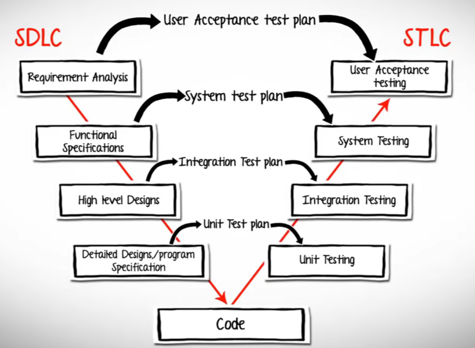

#### Iterative Model:

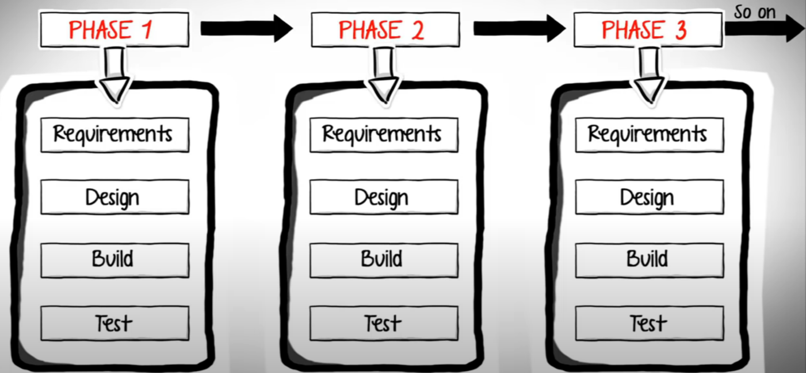
