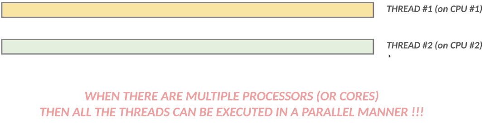

### THREADS

We have to make difference between process and thread.

#### Time-Slicing Algorithm

If PC has a single CPU:

If PC has a multiple CPU:

### Benefits of multithreading

- we can design responsive application
- Better resource utilization: default java app is single threaded. We can utilize more CPU cores with multiple threads.

### Disadvantage

- Multiple thread can modify same data because it is under same memory area (heap), but every thread has a stack.
- Hard to test.

### Create Threads

- implement Runnable: We need to override: run().
  [example](RunnableMain.java)
- extend Thread:
  [example](ThreadMain.java)
- implement Callable. Runnable **can not** return a value to the calling thread but **Callable can**. [Example](CallableMain.java)

### Daemon Thread vs Worker Thread

- Daemon threads are a low priority thread. Runs in the background( garbage collector)
- Usually we create daemon thread for I/O operations or services (NFC/Bluetooth communication)
- Daemon threads are terminated by JVM and when all other worker threads are terminated(finish execution)

  [example](daemonthread/Main.java)

### Priority of Threads

- We can give different priority to the threads (1-10)
- default is 5. Executed in a FIFS(first in first served)
- high priority served before lower, but depends on the underlying OS.

### Intrinsic Lock (Monitor) [example](synch/example2/s02AppWithSync.java)

A class will get a lock so no other thread has access for it and not able to modify it.

Every object has only **one** lock. So if we have 2 independent synchronized methods than the threads have to wait for
each other to release the lock.

[Problem](synch/example2/s03AppWithTwoSyncMethodProblem.java)

[Solution](synch/example2/s04AppWithTwoSyncMethodSolution.java)

### Lock with custom objects

[Customer Object](synch/example2/s05AppWithCustomObjectLock.java)

### Thread communication

What is the difference between wait and sleep?
Let's discuss the difference between sleep and wait. They may seem to be very similar but there are fundamental
differences between them.

- you call wait on the Object while on the other hand you call sleep on the Thread itself
- wait can be interrupter (this is why we need the InterruptedException) while on the other hand sleep can not
- wait (and notify) must happen in a synchronized block on the monitor object whereas sleep does not
- sleep operation does not release the locks it holds while on the other hand wait releases the lock on the object that
  wait() is called on

[Example](synch/example03/ThreadCommunication.java)

### Deadlock

### Thread pools

T.pools keep threads alive at the background and allow to reuse them later on.

#### Executors:

- SingleThread (Every process is executed by a new thread) [Example](executors/SingleThreadExecutor.java)

- FixedThreadPool(n)  [Example](executors/FixedSizeThreadPools.java)
    - if there is more task than thread these stores in **LinkedBlockingQueue** data structured.
- CachedThreadPool - If all given threads are busy executing some tasks and a new task comes the pool will create and
  add a new thread to the executor.
    - If a thread remains idle for 60 secs then it is removed
    - it is used for short parallel tasks
- ScheduledExecutor: [Example](executors/ScheduledThreadPool.java)
    - We can execute a given task at regular intervals, or we can delay.

### Project Loom -> Virtual Threads

Project Loom aims to reduce the effort of writing, maintaining and observing high-throughput thread-based applications.

Thread per-request model: It is a simple model where each request is handled by a separate thread.

<u>Drawback</u>: 

When a thread has performed a blocking operation like connecting to a database or making a network call 
it will be blocked until the operation is complete. 
This means that the thread will not be able to handle any other requests.

<u>Solution</u>: 

1. Add more hardware. This will allow you to increase the number of threads that 
the Operating System can handle.
2. Use asynchronous programming.
This will allow you to use a single thread to handle multiple requests.

<u>Virtual Thread</u>:

A virtual thread is a thread that is not tied to an Operating System thread.
This means that you can create as many virtual threads as you want without worrying 
about the Operating System thread limit.

